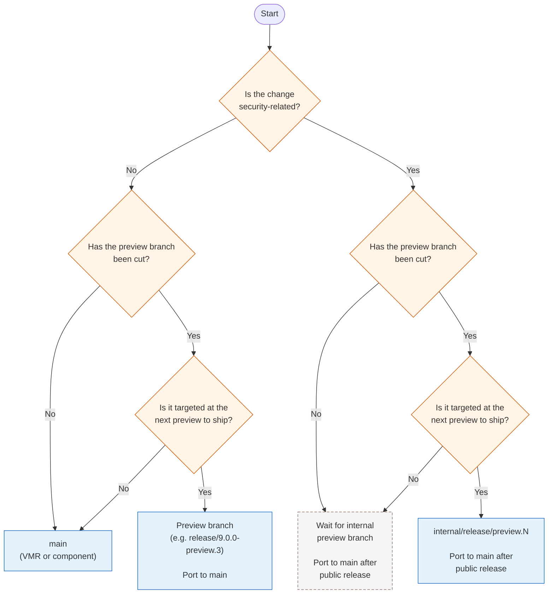
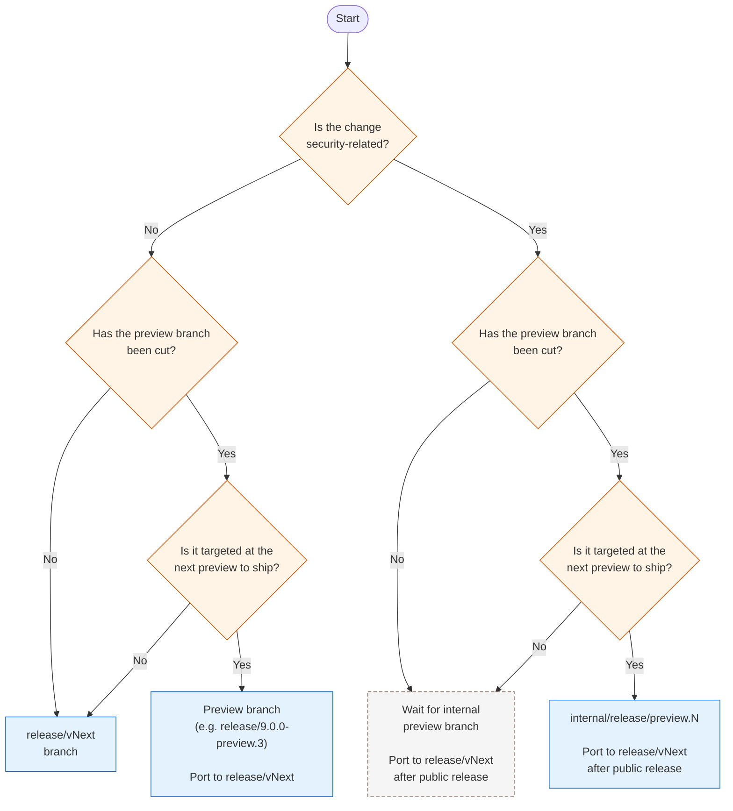
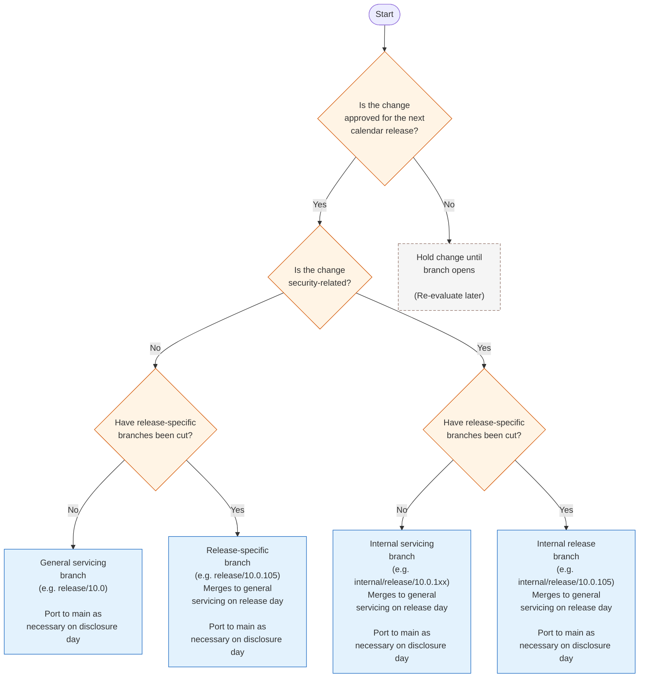

# Developer Check-in Decision Guide

This guide helps you answer “What branch can I check into for my change?” using detailed condition tables for both **vNext/vNext Preview** and **Servicing/Patch** scenarios.

**Tip: When in doubt, ask.**

See also:
- [Servicing Workflow Details](VMR-Servicing-Workflows.md)

---

## Table 1: vNext and vNext Preview Changes

### Servicing branches have not been cut for vNext

| Condition(s)                                                                                                           | Where Can I Check In?                      | Do I need to port the change to avoid regression? |
|------------------------------------------------------------------------------------------------------------------------|--------------------------------------------|-----------------------------------|
| - Change is non-security **AND**   - Preview branch has not been cut **OR** change is not targeted at next preview to ship | **main** in VMR or component repository | No |
| - Change is non-security **AND**   - Preview branch has been cut **AND**   - Change is targeted at next preview to ship | **Preview branch** (e.g. `release/9.0.0-preview.3`) in VMR or component repository. | Yes. Port to main |
| - Change is security **AND**   - Preview branch has not been cut **OR** change is not targeted at next preview to ship | **Wait** for creation of internal preview branches (e.g. internal/release/11.0.0-rc.N branch) | **main**, **AFTER** public release. |
| - Change is security **AND**   - Preview branch has been cut **AND**   - Change is targeted at next preview to ship | **internal/release/preview.N** (e.g. `internal/release/11.0.0-rc.1`) in VMR or component repository. | **main**, **AFTER** public release. |

### Servicing branches have been cut for vNext

| Condition(s)                                                                                                           | Where Can I Check In?                      | Do I need to port the change to avoid regression? |
|------------------------------------------------------------------------------------------------------------------------|--------------------------------------------|-----------------------------------|
| - Change is non-security **AND**   - Preview branch has not been cut **OR** change is not targeted at next preview to ship | **release/vNext** in VMR or component repository | No |
| - Change is non-security **AND**   - Preview branch has been cut **AND**   - Change is targeted at next preview to ship | **Preview branch** (e.g. `release/9.0.0-preview.3`) in VMR or component repository. | Yes. Port to release/vNext |
| - Change is security **AND**   - Preview branch has not been cut **OR** change is not targeted at next preview to ship | **Wait** for creation of internal preview branches (e.g. internal/release/11.0.0-rc.N branch) | **release/vNext**, **AFTER** public release. |
| - Change is security **AND**   - Preview branch has been cut **AND**   - Change is targeted at next preview to ship | **internal/release/preview.N** (e.g. `internal/release/11.0.0-rc.1`) in VMR or component repository. | **release/vNext**, **AFTER** public release. |

---

## Table 2: Servicing (Patch/Hotfix) Changes

| Condition(s)                                                                                                                        | Where Can I Check In?                                 | Do I need to port the change to avoid regression? |
|-------------------------------------------------------------------------------------------------------------------------------------|------------------------------------------------------|-------------------------------|
| Change is non-security **AND**   - Change is approved for next calendar release **AND**   - Release specific branches have not been cut (e.g. release/10.0.105)  |  **General Servicing branch** in VMR or component repository (e.g. release/10.0) | Port to main as necessary on disclosure day |
| Change is not approved for release corresponding to any branch (usually approved for future month's release) | Hold change for branch opening  |  | N/A |
| Change is non-security **AND**   - Change is approved for next calendar release **AND**   - Release specific branches have been cut (e.g. release/10.0.105) | **Release specific branch in VMR** (e.g. release/10.0.105) | Will merge to General Servicing branch on release day. Port to main as necessary on disclosure day. |
| Change is security **AND**   - Change is approved for next calendar release **AND**   - Release specific branches have been cut (e.g. release/10.0.105) | **Internal specific branch in VMR** (e.g. internal/release/10.0.105) | Will merge to General Servicing branch on release day. Port to main as necessary on disclosure day.|
| Change is security **AND**   - Change is approved for next calendar release **AND**   - Release specific branches have not been cut (e.g. release/10.0.105) | Internal release branch (e.g. `internal/release/10.0.1xx`) | Will merge to General Servicing branch on release day. Port to main as necessary on disclosure day. |

---

## Quick Reference Decision Diagrams

**vNext/vNext Preview (servicing branches not cut):**

**vNext/vNext Preview (servicing branches cut):**

**Servicing:**

