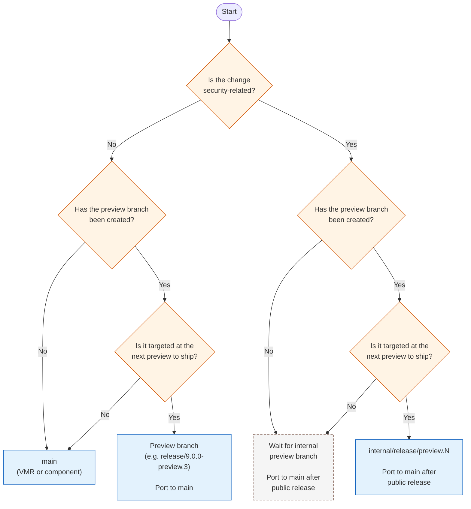
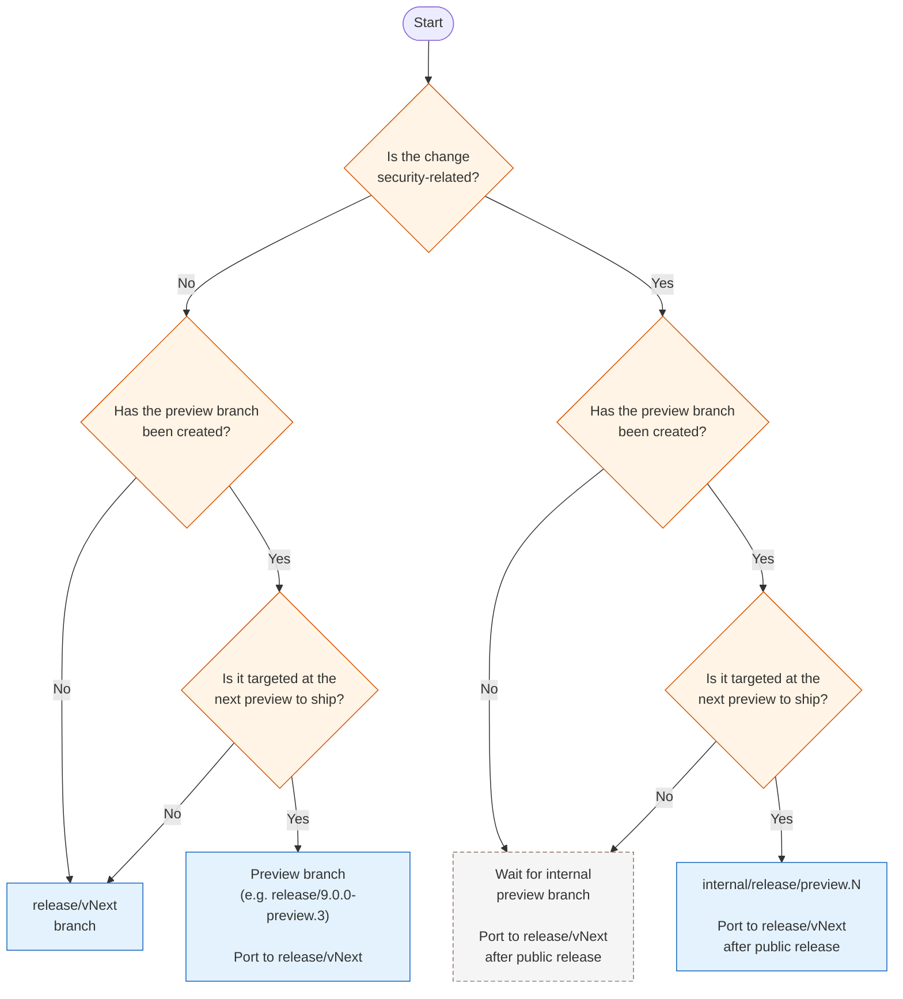
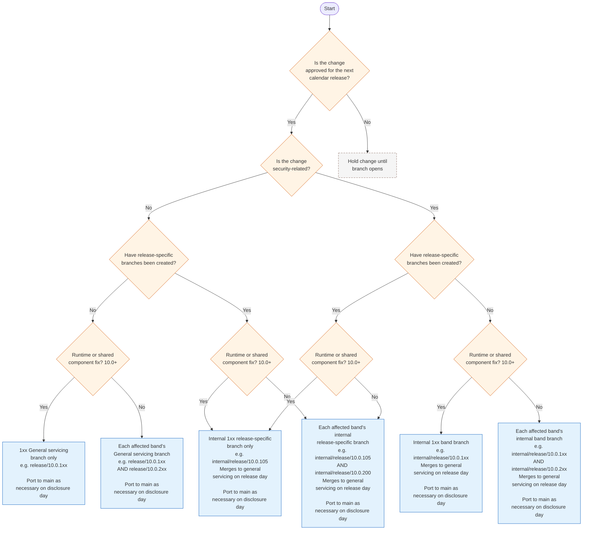

# Developer Check-in Decision Guide

This guide helps you answer “What branch can I check into for my change?” using detailed condition tables for both **vNext/vNext Preview** and **Servicing/Patch** scenarios.

**Tip: When in doubt, ask.**

See also:
- [Servicing Workflow Details](VMR-Servicing-Workflows.md)

---

## Table 1: vNext and vNext Preview Changes

### Servicing branches have not been created for vNext

| Condition(s)                                                                                                           | Where Can I Check In?                      | Do I need to port the change to avoid regression? |
|------------------------------------------------------------------------------------------------------------------------|--------------------------------------------|-----------------------------------|
| - Change is non-security **AND**   - Preview branch has not been created **OR** change is not targeted at next preview to ship | **main** in VMR or component repository | No |
| - Change is non-security **AND**   - Preview branch has been created **AND**   - Change is targeted at next preview to ship | **Preview branch** (e.g. `release/9.0.0-preview.3`) in VMR or component repository. | Yes. Port to main |
| - Change is security **AND**   - Preview branch has not been created **OR** change is not targeted at next preview to ship | **Wait** for creation of internal preview branches (e.g. internal/release/11.0.0-rc.N branch) | **main**, **AFTER** public release. |
| - Change is security **AND**   - Preview branch has been created **AND**   - Change is targeted at next preview to ship | **internal/release/preview.N** (e.g. `internal/release/11.0.0-rc.1`) in VMR or component repository. | **main**, **AFTER** public release. |

### Servicing branches have been created for vNext

| Condition(s)                                                                                                           | Where Can I Check In?                      | Do I need to port the change to avoid regression? |
|------------------------------------------------------------------------------------------------------------------------|--------------------------------------------|-----------------------------------|
| - Change is non-security **AND**   - Preview branch has not been created **OR** change is not targeted at next preview to ship | **release/vNext** in VMR or component repository | No |
| - Change is non-security **AND**   - Preview branch has been created **AND**   - Change is targeted at next preview to ship | **Preview branch** (e.g. `release/9.0.1xx-preview3`) in VMR or component repository. | Yes. Port to release/vNext |
| - Change is security **AND**   - Preview branch has not been created **OR** change is not targeted at next preview to ship | **Wait** for creation of internal preview branches (e.g. internal/release/11.0.1xx-rcN branch) | **release/vNext**, **AFTER** public release. |
| - Change is security **AND**   - Preview branch has been created **AND**   - Change is targeted at next preview to ship | **internal/release/preview.N** (e.g. `internal/release/11.0.1xx-rc1`) in VMR or component repository. | **release/vNext**, **AFTER** public release. |

---

## Table 2: Servicing (Patch/Hotfix) Changes

> **Multi-band note (10.0+):** For 10.0+ releases, the runtime source code only lives in the **1xx band branch** (e.g., `release/10.0.1xx`) and in release-specific branches derived from it (e.g., `internal/release/10.0.105`). Non-1xx band branches consume the runtime as build output packages that automatically flow from the 1xx build.
>
> - **Runtime / shared-component fixes** – Check the fix into the **1xx band branch only** (e.g., `release/10.0.1xx` or `internal/release/10.0.1xx`). The updated packages flow automatically to 2xx and higher band branches.
> - **SDK / band-specific fixes** – Check the fix into **each band branch** that requires it (e.g., both `release/10.0.1xx` and `release/10.0.2xx`).
>
> See [Managing SDK Bands – Servicing fixes across bands](./VMR-Managing-SDK-Bands.md#servicing-fixes-across-bands) for full details.

| Condition(s)                                                                                                                        | Where Can I Check In?                                 | Do I need to port the change to avoid regression? |
|-------------------------------------------------------------------------------------------------------------------------------------|------------------------------------------------------|-------------------------------|
| - Change is non-security **AND**   - Change is approved for nearest upcoming servicing release **AND**   - Release specific branches have not been created (e.g. internal/release/10.0.105)   - **Runtime/shared-component fix (10.0+)** | **General Servicing 1xx band branch** in VMR or component repository (e.g. `release/10.0.1xx`) | Port to main as necessary on disclosure day |
| - Change is non-security **AND**   - Change is approved for nearest upcoming servicing release **AND**   - Release specific branches have not been created (e.g. internal/release/10.0.105)   - **SDK/band-specific fix (10.0+)** | **Each affected General Servicing band branch** in VMR or component repository (e.g. `release/10.0.1xx` and `release/10.0.2xx`) | Port to main as necessary on disclosure day |
| - Change is not approved for release corresponding to any branch (usually approved for future month's release) | Hold change for branch opening  | N/A |
| - Change is non-security **AND**   - Change is approved for nearest upcoming servicing release **AND**   - Release specific branches have been created (e.g. internal/release/10.0.105)   - **Runtime/shared-component fix (10.0+)** | **Internal 1xx release specific branch in VMR** (e.g. `internal/release/10.0.105`) | Will merge to General Servicing branch on release day. Port to main as necessary on disclosure day. |
| - Change is non-security **AND**   - Change is approved for nearest upcoming servicing release **AND**   - Release specific branches have been created (e.g. internal/release/10.0.105)   - **SDK/band-specific fix (10.0+)** | **Each affected internal release specific branch in VMR** (e.g. `internal/release/10.0.105` and `internal/release/10.0.200`) | Will merge to General Servicing branches on release day. Port to main as necessary on disclosure day. |
| - Change is security **AND**   - Change is approved for nearest upcoming servicing release **AND**   - Release specific branches have been created (e.g. internal/release/10.0.105) | **Internal release specific branch in VMR** (e.g. internal/release/10.0.105). For SDK/band-specific fixes, target each affected band's release specific branch. | Will merge to General Servicing branch on release day. Port to main as necessary on disclosure day.|
| - Change is security **AND**   - Change is approved for nearest upcoming servicing release **AND**   - Release specific branches have not been created (e.g. internal/release/10.0.105) | **Internal 1xx band branch** (e.g. `internal/release/10.0.1xx`) for runtime/shared fixes. For SDK/band-specific fixes, target each affected `internal/release/10.0.Nxx` branch. | Will merge to General Servicing branch on release day. Port to main as necessary on disclosure day. |

---

## Quick Reference Decision Diagrams

**vNext/vNext Preview (servicing branches not created):**

```mermaid
flowchart TD
    classDef decision fill:#fff4e5,stroke:#d35400,stroke-width:1px;
    classDef action fill:#e3f2fd,stroke:#1565c0,stroke-width:1px;
    classDef wait fill:#f5f5f5,stroke:#8d6e63,stroke-dasharray:5 3;

    start([Start])
    security{Is the change<br/>security-related?}
    nonSecPreviewCut{Has the preview branch<br/>been created?}
    nonSecTargetNext{Is it targeted at the<br/>next preview to ship?}
    secPreviewCut{Has the preview branch<br/>been created?}
    secTargetNext{Is it targeted at the<br/>next preview to ship?}

    mainDev["main<br/>(VMR or component)"]
    previewBranchMain["Preview branch<br/>(e.g. release/9.0.0-preview.3)<br/><br/>Port to main"]
    waitInternalMain["Wait for internal<br/>preview branch<br/><br/>Port to main after<br/>public release"]
    internalPreviewMain["internal/release/preview.N<br/><br/>Port to main after<br/>public release"]

    start --> security
    security -- "No" --> nonSecPreviewCut
    security -- "Yes" --> secPreviewCut

    nonSecPreviewCut -- "No" --> mainDev
    nonSecPreviewCut -- "Yes" --> nonSecTargetNext
    nonSecTargetNext -- "Yes" --> previewBranchMain
    nonSecTargetNext -- "No" --> mainDev

    secPreviewCut -- "No" --> waitInternalMain
    secPreviewCut -- "Yes" --> secTargetNext
    secTargetNext -- "Yes" --> internalPreviewMain
    secTargetNext -- "No" --> waitInternalMain

    class security,nonSecPreviewCut,nonSecTargetNext,secPreviewCut,secTargetNext decision;
    class mainDev,previewBranchMain,internalPreviewMain action;
    class waitInternalMain wait;
```

**vNext/vNext Preview (servicing branches created):**

```mermaid
flowchart TD
    classDef decision fill:#fff4e5,stroke:#d35400,stroke-width:1px;
    classDef action fill:#e3f2fd,stroke:#1565c0,stroke-width:1px;
    classDef wait fill:#f5f5f5,stroke:#8d6e63,stroke-dasharray:5 3;

    start([Start])
    security{Is the change<br/>security-related?}
    nonSecPreviewCut{Has the preview branch<br/>been created?}
    nonSecTargetNext{Is it targeted at the<br/>next preview to ship?}
    secPreviewCut{Has the preview branch<br/>been created?}
    secTargetNext{Is it targeted at the<br/>next preview to ship?}

    releaseVNext["release/vNext<br/>branch"]
    previewBranchRelease["Preview branch<br/>(e.g. release/9.0.0-preview.3)<br/><br/>Port to release/vNext"]
    waitInternalRelease["Wait for internal<br/>preview branch<br/><br/>Port to release/vNext<br/>after public release"]
    internalPreviewRelease["internal/release/preview.N<br/><br/>Port to release/vNext<br/>after public release"]

    start --> security
    security -- "No" --> nonSecPreviewCut
    security -- "Yes" --> secPreviewCut

    nonSecPreviewCut -- "No" --> releaseVNext
    nonSecPreviewCut -- "Yes" --> nonSecTargetNext
    nonSecTargetNext -- "Yes" --> previewBranchRelease
    nonSecTargetNext -- "No" --> releaseVNext

    secPreviewCut -- "No" --> waitInternalRelease
    secPreviewCut -- "Yes" --> secTargetNext
    secTargetNext -- "Yes" --> internalPreviewRelease
    secTargetNext -- "No" --> waitInternalRelease

    class security,nonSecPreviewCut,nonSecTargetNext,secPreviewCut,secTargetNext decision;
    class releaseVNext,previewBranchRelease,internalPreviewRelease action;
    class waitInternalRelease wait;
```

**Servicing:**

```mermaid
flowchart TD
    classDef decision fill:#fff4e5,stroke:#d35400,stroke-width:1px;
    classDef action fill:#e3f2fd,stroke:#1565c0,stroke-width:1px;
    classDef wait fill:#f5f5f5,stroke:#8d6e63,stroke-dasharray:5 3;

    start([Start])
    approved{Is the change<br/>approved for the next<br/>calendar release?}
    security{Is the change<br/>security-related?}
    releaseCutNonSec{Have release-specific<br/>branches been created?}
    releaseCutSec{Have release-specific<br/>branches been created?}
    componentTypeNonSecNoCut{Runtime or shared<br/>component fix? 10.0+}
    componentTypeNonSecCut{Runtime or shared<br/>component fix? 10.0+}
    componentTypeSecNoCut{Runtime or shared<br/>component fix? 10.0+}
    componentTypeSecCut{Runtime or shared<br/>component fix? 10.0+}

    generalServicing1xx["1xx General servicing<br/>branch only<br/>e.g. release/10.0.1xx<br/><br/>Port to main as<br/>necessary on disclosure day"]
    generalServicingAllBands["Each affected band's<br/>General servicing branch<br/>e.g. release/10.0.1xx<br/>AND release/10.0.2xx<br/><br/>Port to main as<br/>necessary on disclosure day"]
    internalSpecific1xx["Internal 1xx release-specific<br/>branch only<br/>e.g. internal/release/10.0.105<br/>Merges to general<br/>servicing on release day<br/><br/>Port to main as<br/>necessary on disclosure day"]
    internalSpecificAllBands["Each affected band's internal<br/>release-specific branch<br/>e.g. internal/release/10.0.105<br/>AND internal/release/10.0.200<br/>Merges to general<br/>servicing on release day<br/><br/>Port to main as<br/>necessary on disclosure day"]
    internalGeneral1xx["Internal 1xx band branch<br/>e.g. internal/release/10.0.1xx<br/>Merges to general<br/>servicing on release day<br/><br/>Port to main as<br/>necessary on disclosure day"]
    internalGeneralAllBands["Each affected band's<br/>internal band branch<br/>e.g. internal/release/10.0.1xx<br/>AND internal/release/10.0.2xx<br/>Merges to general<br/>servicing on release day<br/><br/>Port to main as<br/>necessary on disclosure day"]
    holdChange["Hold change until<br/>branch opens"]

    start --> approved
    approved -- "No" --> holdChange
    approved -- "Yes" --> security

    security -- "No" --> releaseCutNonSec
    security -- "Yes" --> releaseCutSec

    releaseCutNonSec -- "No" --> componentTypeNonSecNoCut
    releaseCutNonSec -- "Yes" --> componentTypeNonSecCut

    componentTypeNonSecNoCut -- "Yes" --> generalServicing1xx
    componentTypeNonSecNoCut -- "No" --> generalServicingAllBands

    componentTypeNonSecCut -- "Yes" --> internalSpecific1xx
    componentTypeNonSecCut -- "No" --> internalSpecificAllBands

    releaseCutSec -- "No" --> componentTypeSecNoCut
    releaseCutSec -- "Yes" --> componentTypeSecCut

    componentTypeSecNoCut -- "Yes" --> internalGeneral1xx
    componentTypeSecNoCut -- "No" --> internalGeneralAllBands

    componentTypeSecCut -- "Yes" --> internalSpecific1xx
    componentTypeSecCut -- "No" --> internalSpecificAllBands

    class approved,security,releaseCutNonSec,releaseCutSec,componentTypeNonSecNoCut,componentTypeNonSecCut,componentTypeSecNoCut,componentTypeSecCut decision;
    class generalServicing1xx,generalServicingAllBands,internalSpecific1xx,internalSpecificAllBands,internalGeneral1xx,internalGeneralAllBands action;
    class holdChange wait;
```
