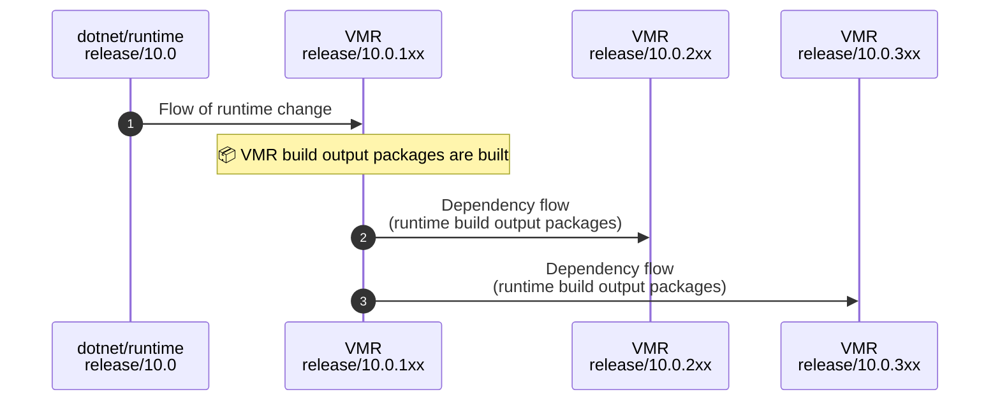
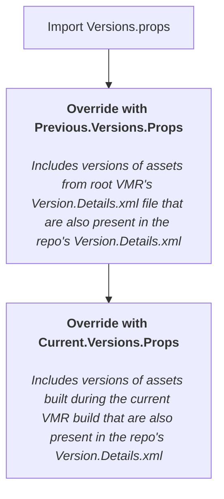

# Feature Band Support: Work Plan

This document builds on top of [Managing SDK Bands](https://github.com/dotnet/dotnet/blob/main/docs/VMR-Managing-SDK-Bands.md) with a concrete work plan for providing feature band support in the VMR. Please read that doc as a prerequisite.

Document convention:
* There can be a variable number of feature band releases (e.g. 10.0.1xx, 10.0.2xx, 10.0.3xx, etc). For purposes of this document, we mainly care about the distinction between the 1xx branch and all the other non-1xx feature band branches. For simplicity, 2xx will be used as a notation to mean any non-1xx feature band branch.

## Plan Details

### Branch Management

The 2xx branch sources should accurately reflect what gets produced in the output. Since the shared component are only being produced in the 1xx branch, those associated repos will be excluded from the 2xx branch upon creation. The benefits of of removing the source include the following:
* Avoids confusion about which source is relevant in the production of the build
* Avoids the need to determine if or when repo sources should be updated with the latest from the 1xx branch.
* Avoids any compliance issues with the code getting stale if it hasn't been updated (e.g. CodeQL alerts).

One exception is the Arcade repo which will be present in all branches. It's not technically required to exist in the 2xx branch in all cases. But there have historically been cases where Arcade changes are necessary in order to support new SDK features not in the 1xx branch. To account for those cases, it'll be a smoother process to simply always have Arcade present in those branches. There isn't an impact in the output of the build since Arcade isn't a shipping component.

Rather than deleting the associated projects in the `repo-projects` directory, it may make sense to keep those and trim the dependency graph of `RepositoryReferences` using a condition based on whether it's the 1xx branch or not.

There should be tooling to help with this exclusion process for the VMR maintainers. This can potentially be integrated into the broader workflow that is necessary when branching such as branding updates and pipeline changes. The tooling could potentially make use of the dependency graph described by the `repo-projects` directory to determine which repos need to be removed.

### Dependency Flow

Repos in the 2xx+ branches of the VMR which have dependencies on repos solely defined in the 1xx branch (e.g. `sdk` repo's dependency on `runtime`) will need to have some sort of dependency flow that moves the output of the 1xx build to the 2xx++ builds.

This could be done a few different ways, but there are some explicit goals that point in a specific direction:
- **Repeatability** - The product produced from the 2xx++ branches should not vary in a meaningful way if the source has not changed.
- **Speed** - The time/number of steps required to build 2xx+ should be minimized.
- **Distro partner/MSFT build unification** - We should minimize differences between the distro partner and MSFT builds.

To achieve 2xx+ builds, we will use the "classic" dependency flow methodology that .NET has used for many years. The VMR's root `Version.Details.xml`/`Versions.props` files will be updated to include all dependencies used to "bootstrap" the .NET build. This includes 1xx branches. *Note: Despite having a reduced set of repos, 2xx+ branches will not have a "reduced" set of dependencies.* The intention here is that this is essentially a representation of the "previously source-built" concept that is present in source-build. We are just extending this concept to Microsoft's distribution, and making the representation explicit.

When building a repo within the VMR, the following version flow will be applied:

- Import Versions.props
- Import generated Previous.Versions.props -
  - Includes versions of assets from root VMR's Version.Details.xml file that are also present in the repo's `Version.Details.xml`
- Import generated Current.Versions.props - 
  - Includes versions of assets built during the current VMR build that are also present in the repo's `Version.Details.xml`

**Considerations**

- **Validation of 2xx+ repos** - A repo is validated on backflow based on what it built against. So a 1xx SDK repo branch receives the source changes in the 1xx VMR sdk sources, as well as the outputs of the VMR build, which includes the runtime that the SDK built against in that VMR build. This means that on backflow, the SDK PR is validating the SDK's sources against the updated SDK dependencies. For 2xx+ branches, only a subset of outputs is produced, so a backflow PR would not include all the dependencies that the 2xx SDK needs. To deal with this, we will attempt to use the CoherentParentDependency feature. CoherentParentDependency attributes will be placed on the SDK dependencies that are not produced in the 2xx build, tying them to a dependency produced in the 2xx build. When backflow happens and the dependencies are updated for a repo, the CPDs will resolve to the versions specific in the root VMR Version.Details.xml if they are not produced in the current build.
- **Distro partner previously-source-built update process** - Right now distro partners will build a given release by taking a set of previously SB artifacts (provided by MS or source-built by the distro partner), and pass these to the build script via --with-packages and --with-sdk. Going forward, this step will either be preceded by an explicit step to update the root `Version.Details.xml` with these packages, or this switch will imply such a step. Therefore, when the build is running, the previously source-built inputs and their versions are specified by the `Version.Details.xml` file, and NuGet will find those packages in the directory passed via --with-packages. Essentially, we are eliminating some implicit behavior.

### Toolset

Each feature band branch will start out using the N-1 toolset version and then build on top of itself for each subsequent release. For example, when 10.0.2xx branch is first created (for the 10.0.204 release, for example), it will use the 10.0.104 toolset from the 1xx branch. Then for the 10.0.205 release, the 10.0.2xx branch will be updated to reference the 10.0.204 toolset (the one from the previous 2xx release).

### Build

* In addition to NuGet package, we also need to provide a way to have access to the runtime and ASP.NET Core artifacts (e.g. `dotnet-runtime-<version>-linux-x64.tar.gz`) from 2xx branches. This is necessary for the SDK to be able to bundle things together. This should be able to be done using https://ci.dot.net, just as it is done in product repo builds.
* While the `scenario-tests` repo doesn't have differing code for each feature band, it will still need to exist in each of the VMR's feature band branches because it is built as part of the pipeline run and used to validate the product. This is ok since it is not part of the shipped binaries.

There will need to be some way to detect when we are in one of these 2xx branches. For example, the [`sdk` needs different logic to determine from where it should target the artifacts it redistributes](https://github.com/dotnet/dotnet/issues/1109). It can determine this by checking the [`VersionSDKMinor` property in the `sdk`](https://github.com/dotnet/dotnet/blob/dce660c5e1445100011f2d528e64410f4afc2f60/src/sdk/eng/Versions.props#L8) which gets incremented for each feature band.

#### Source-Only Builds

For source-only builds, you're going to need to build all the source, including the source from the 1xx branch in order to produce a release from a 2xx branch.

There are a variety of scenarios to consider:

1. Has the distro maintainer produced any 1xx assets before from the previous release?
    * If yes:
      * Build 1xx branch using artifacts and SDK from previous 1xx release as input
    * If no:
      * Build 1xx branch using Microsoft artifacts and SDK
      * Rebuild 1xx branch using output of first build as input
1. Is this the initial release of the feature band?
    * If yes:
      * Build 2xx branch using output of 1xx artifacts and SDK as input
    * If no:
      * Has the distro maintainer produced any 2xx assets before from the previous release?
        * If yes:
          * Build 2xx branch using artifacts and SDK from previous 2xx release and the shared component 1xx artifacts as input
        * If no:
          * Build 2xx branch using Microsoft 2xx artifacts and shared component 1xx artifacts as input
          * Rebuild 2xx branch using output of first build as input

The assertion with these scenarios is that a minimum of 2 and maximum of 4 builds are required to produce source built output for a 2xx feature band. It will never be necessary to depend on any other feature band besides 1xx and the target feature band. For example, it would never be necessary for a distro maintainer to build the 3xx feature band in order to source build the 4xx feature band.

In order to facilitate the actions that will need to be taken by a distro maintainer or developer, new scripts should be provided (or existing ones updated). Specifically, provide a way to combine the output artifacts from multiple builds to be used as input. An alternative to combining artifacts is to have separate tarball inputs. See the implications of this design choice in [poison leak detection](#poison-leak-detection).

❓ Open Question:

Should a distro maintainer be required to build the *entire* 1xx branch VMR (including the SDK)? That's easier to implement but also potentially wasteful if they're not going to be producing a release for that feature branch. Otherwise, there'd need to be some way to filter which repos get built such that only the repos excluded from the 2xx branch get built. Including all packages, including tools, rather than just shared components, has implications for [poison leak detection](#poison-leak-detection) which need to be considered.

##### Poison Leak Detection

Source build [poison leak detection](https://github.com/dotnet/source-build/blob/main/Documentation/leak-detection.md) will need to exclude all shared component files that originate from packages produced by the 1xx branch. For example, the `System.Xml.dll` file included in the 2xx SDK originates from the 1xx branch. The intention of poison leak detection is to enforce that all source-built files can be serviceable. In the case of shared components coming from the 1xx branch, it is inherently true that they are serviceable in that branch. And they can then be safely redistributed in the 2xx branch. This is only true for shared component files. Files from tools, such as Roslyn, that originate from the 1xx branch may not be safely redistributed in the 2xx branch because the tools are meant to be produced by the 2xx output; if that were to happen, this should be considered a poison leak.

Poison leak detection influences the design choices around other questions:
* Whether artifacts provided as input to a 2xx build are separated out between 2xx PSB artifacts and 1xx artifacts or whether they are combined. If the artifact sets are provided as separate inputs, you know which are from 1xx and can designate those appropriately according to the poisoning requirements described in the previous paragraph. If they are combined, you need a way to know which came from 1xx which may require some sort of manifest file.
* Whether a distro maintainer is required to build the *entire* 1xx branch, including tools such as Roslyn. This files from the tools would be contained in the 1xx artifacts and you'd need a way to distinguish those from the shared components so that you can allow redistribution of the shared components but disallow those from the tools.

### UB Pipeline Changes

#### Microsoft Build Legs

Some of the Microsoft build legs will need to be trimmed from the 2xx branch. Specifically, there are short stack and cross-OS DAC builds that only build the runtime repo. These would not be relevant for the 2xx branch and should be excluded in the pipeline.

Darc publishing will need to be enabled at the VMR level to allow the packages produced from the 1xx build to flow and be consumed by the sources in the 2xx branch.

#### Source-Only Build Legs

Given that the packages outputted from the 1xx branch are needed in order to source build the 2xx branch, changes will be needed to the pipelines. In order to make the build efficient, we can collect the output of the 1xx branch's official build and feed that in as input to the 2xx branch build. There's no need to build the 1xx branch again from source since it's already been done.

In order to do this, there needs to be a mechanism to publish the source-built packages from a 1xx official build so that they can be consumed by a 2xx build. There are a variety of options that can be considered:
* Publish each source-built NuGet package to a NuGet feed (probably specific to source build). These would then be downloaded all together by using [NuGet search functionality](https://learn.microsoft.com/nuget/reference/nuget-client-sdk#search-packages) by filtering on the package version.
* Publish each source-built artifacts tarball to blob storage. This would then be downloaded by constructing a URL that contains the necessary version.
* Reintroduce source-built intermediates but have them published at the VMR level for each repo built there. These would be published to a NuGet feed. These would be downloaded by enumerating each of the repos and downloading the specific version needed.

One consideration to make here is for the scenario of internal builds. Whatever publishing mechanism is chosen will need to provide support for authenticated access to the published artifacts that comes with internal builds.

Note that each distro/architecture combination needs to publish its own set of packages. For example, there needs to be a set of package published for AlmaLinux x64, CentOS Stream 9 x64, Ubuntu 24.04 arm64, etc.

Once the 2xx branch gets updated with dependency flow with the output of the 1xx build, the dependency information can be used to determine which artifact version needs to be downloaded as part of the source build prep script. The logic really just needs to know the package version of a component that was produced by the 1xx build, such as a package from `runtime`. Once that version is known, that can be used to target the appropriate version of the artifact to download and include as input packages to the source-only build.

### Source Build Release

The Source Build release pipeline requires updating to handle multiple VMR branches.
