# Full VMR code flow

- [Full VMR code flow](#full-vmr-code-flow)
  - [Purpose](#purpose)
  - [Terminology](#terminology)
  - [High-level code flow](#high-level-code-flow)
    - [Forward flow](#forward-flow)
    - [Backflow](#backflow)
  - [The code flow algorithm](#the-code-flow-algorithm)
      - [Legend](#legend)
      - [Diagram events explained](#diagram-events-explained)
    - [Pseudo-code](#pseudo-code)
    - [Previous flow direction detection](#previous-flow-direction-detection)
      - [Detecting incoming flow](#detecting-incoming-flow)
      - [Detecting outgoing flow](#detecting-outgoing-flow)
      - [Cases when SHA is not in the graph](#cases-when-sha-is-not-in-the-graph)
    - [Conflicts](#conflicts)
    - [Parallel flows](#parallel-flows)
    - [Updating PRs](#updating-prs)
  - [Synchronization configuration](#synchronization-configuration)
    - [Arcade](#arcade)
      - [Updating `eng/common`](#updating-engcommon)
      - [Updating `global.json`](#updating-globaljson)

## Purpose

This document describes the architecture of the full code flow between product repositories and the VMR.

## Terminology

This section presents more precise definitions of common terms used in this document that may be prone to confusion. Also see the [Unified Build terminology](./Terminology.md) for more.

- **Individual/Source/Product repository** – One of the current development repositories, e.g., `dotnet/runtime`. An "individual product repository" is then one that contains code for part of the product (but no individual repository contains code to build the whole .NET Core product).
- **VMR (Virtual Monolithic Repository)** – A repository containing code layout that produces the official build product of .NET. The repository contains individual product repositories plus tooling to enable a full build of the product.
- **Maestro** - A service used by the .NET team to manage dependency flow between repositories. For more information about channels, subscriptions and other Maestro concepts, see the [Maestro documentation](https://github.com/dotnet/arcade/blob/main/Documentation/BranchesChannelsAndSubscriptions.md).
- **BAR / Build Asset Registry** - A database of build assets (e.g. packages) and their associated metadata (e.g. commit, build number, etc.). For more information about BAR, see the [BAR documentation](https://github.com/dotnet/arcade/blob/main/Documentation/Maestro/BuildAssetRegistry.md).
- **Forward flow** – The process of moving changes from an individual repository to the VMR.
- **Backflow** - The process of moving changes from the VMR to an individual repository.
- **Codeflow** - The process of moving changes between the VMR and individual repositories. This is a generic term that can refer to both forward flow and backflow.
- **Codeflow PR** - A pull request carrying the code changes that is opened as part of the codeflow process. This can be a forward flow PR or a backflow PR.

## High-level code flow

### Forward flow

The high-level flow of changes from an individual repository (e.g. `dotnet/runtime`) to the VMR is as follows:

1. A change is merged into the individual repository (e.g. `dotnet/runtime`).
2. The change is mirrored to Azure DevOps (AzDO) and the internal build of the individual repository starts.
3. The build is registered in the Build Asset Registry (BAR) and assigned to one or more channels.
4. The Maestro service listens to BAR events and triggers the appropriate subscriptions.
5. A subscription in the VMR is triggered, which opens a pull request in the VMR (or an existing one is updated if possible).

### Backflow

For backflow, the situation is quite similar:

1. A change is made to the VMR (a PR is merged).
2. The change is mirrored to AzDO and the official VMR build starts.
3. The VMR is built, output packages are produced and the build is published to BAR.
4. The Maestro service notices a VMR subscription triggered and opens a PR in every individual repository that is subscribed to the VMR.
  - The subscriptions which are source-enabled will also carry the code changes of the individual repository (if any happened in the VMR).
  - Non-source-enabled (codeflow) subscriptions will only update the version files and bump packages in any repository relying on packages built in the VMR.

The only difference from the forward flow is that the for source-enabled (codeflow) subscriptions, the backflow PRs contain the code changes as well as package updates built in the latest VMR build.

## The code flow algorithm

This section describes the details of moving the code between product repositories and the VMR. The algorithm will try to achieve maximum fluency and minimize the amount of conflicts developers need to tend to. However, it will ensure that conflicting changes manifest as conflicts that developers need to resolve manually and changes are not overridden silently.

The algorithm will always consider the delta between the VMR and the repository and we will flow this delta via a pull request that will be opened in the counterpart side. It is expected that there will be an ongoing forward/backflow PR open at most times and the order in which the repositories will synchronize in can be random. As an example, a backflow might be blocked for an extended period of time because of failures in the PR gates. While this is happening, the forward flow can continue and the VMR can be updated with the latest changes from the repository. For this reason, we need to have a look at the algorithm with respect to its context - e.g. the direction of the current and the last synchronization. This means that we need to look at the following flow combinations:
- Forward flow after backflow
- Backflow after forward flow
- Two flows in the same direction

The diagrams for these four situations can be seen here:

| Previous flow / Current flow | Then backward | Then forward |
|------------------------------|:-------------:|:------------:|
| Backward first               | 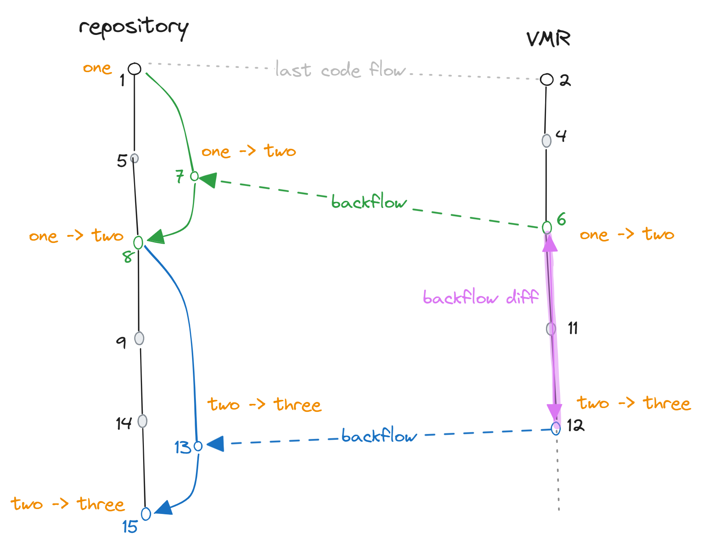 | 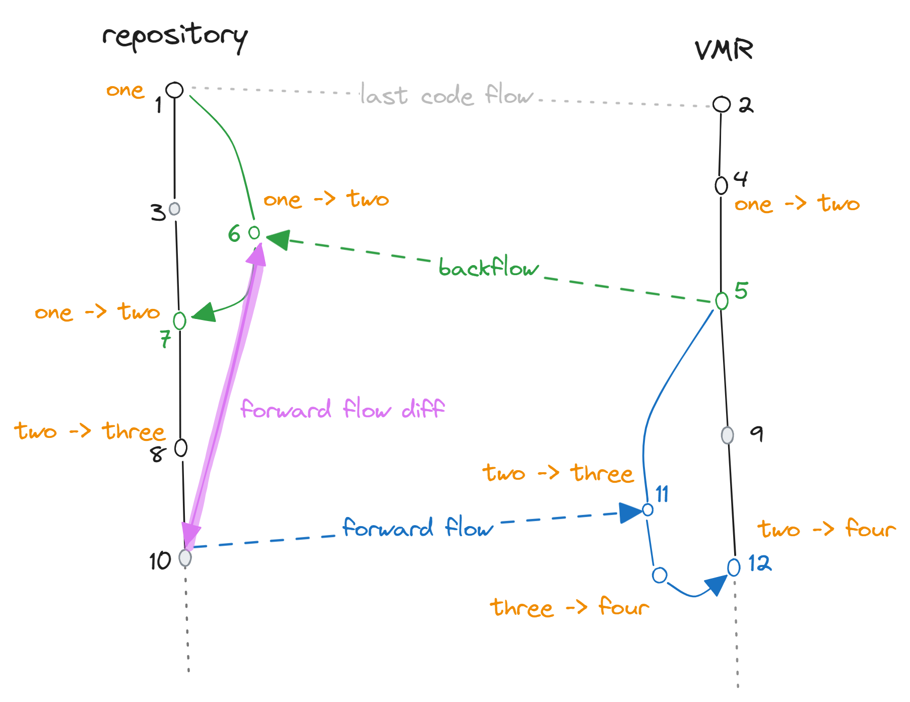 |
| Forward first                | 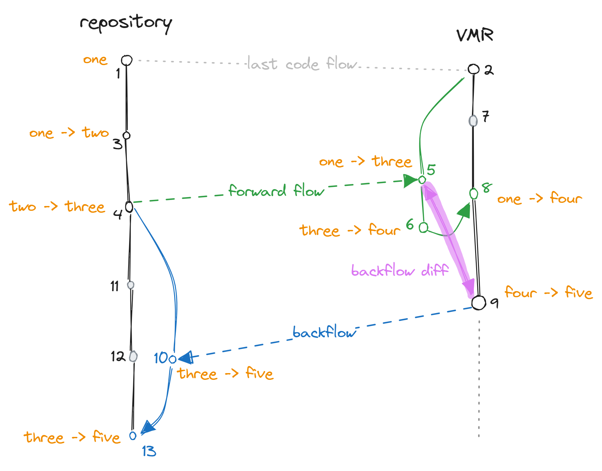 | 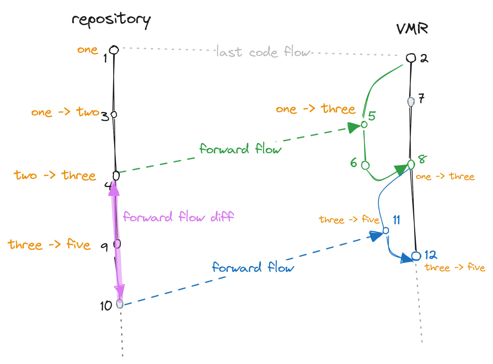 |

#### Legend

The diagrams above visualizes the algorithm and shows which diffs are used to create the PRs. The diagrams use the following common notation:
- 🟠 The repository contains an example file (say `A.txt`). This file contains a single line of text. The content of the file transformations are denoted in orange. The file starts with the text `one` and ends with the text `five`. The label `two -> three` then denotes a commit that changed the content from `two` to `three`.
- 🟢 Green arrows denote the previous successful flow. Green commits and branches then show where the PR branches are originating and which commits belong to them.
- 🔵 Blue arrows denote the flow we're interested in in the current diagram. Blue commits and branches then show where the PR branches are originating and which commits belong to them.
- 🟣 In purple, we visualize the actual diff that we need to carry over to the counterpart repository.
- ⚫ Greyed out commits denote commits that do not affect the `A.txt` file but contain an unrelated change done in the given repository.
- We usually assume that some previous synchronization happened (points `1` <-> `2`) and the 🟢 previous synchronization was done based on the same algorithm.
- The commits are numbered and happen in the order of the numbers. The numbers are used to refer to the commits in the text.
- Editable source version of diagrams is [here](https://excalidraw.com/#json=2QlCyifI87WwEdysg_Ybg,ZPCAufuEmT1SybVB1ooSWA).


<p align="center">
  🖼️ Image #1 - Backflow after forward flow
</p>

#### Diagram events explained

**The flow of changes in the diagram is as follows:**  
`1` and `2` denote some previous synchronization point.
`3` Commit in the repository changes the contents of `A.txt` to `two`.  
`4` Commit in the repository changes the contents of `A.txt` to `three`. Forward flow also starts at that point (this is arbitrary).  
`5` A forward-flow branch (green) is created in the VMR. The branch is based on the commit of last synchronization (`2`). How this forward flow is created is not the subject of this diagram. Here, we are interested in the following flow.  
`6` An additional arbitrary commit is made in the forward flow PR which changes the contents of `A.txt` to `four` (i.e. fixing the build).  
`7` A commit is made to the main branch of the VMR, content is unrelated.  
`8` Forward flow PR is merged, effectively updating `A.txt` from `one` to `four`.  
`9` A commit is made to the main branch of the VMR, changing content from `four` to `five`. Backflow starts at that point (this is arbitrary).  
`10` A backflow branch (blue) is created in the repository. The branch is based on the commit of last synchronization's (`2`) base commit. The content on the commit is [described below](#backflow-commit). A PR from this branch is opened.  
`11` A commit is made to the main branch of the repository, content is unrelated.  
`12` A commit is made to the main branch of the repository, content is unrelated.  
`13` The PR is merged, effectively updating `A.txt` from `three` to `five`.

**You can notice several features:**
- No (git) conflicts appear. This is because this concrete example considers a single file that is chronologically changed from `one` to `five` in gradual steps. In such case, we should not expect any conflicts and this is by design. In cases where most of the changes happen in the individual repository, we expect the code to flow fluently.
- The whole flow is comparable to a dev working in a dev branch within a single repository - the dev branch being the VMR where the dev merges the main branch in between the work (this is the forward flow). The dev then opens a PR against the main branch (the repository in this case). Wherever there would be conflicts in a single repository case, we would get conflicts here too and this is by design.

What is left to discuss is how we create the commit (`10`) of the backflow branch. We know that we received the delta from the repository as part of the commit `8` after the last forward flow PR was merged. We assume that a squash merge was used and commits `5` and `6` are no longer available.  
The delta between the repositories when commit `9` (which we will backflow) happens is technically commits `6`, `7` and `9` is visualized as the purple diff between `9` and `5`. This diff correctly represents the delta because:
- It contains the last known snapshot of the repository (`5`)
- All commits that happened in the VMR in the meantime (since the last commit) - the commit `7`.
- The other commits that happened in the VMR since the sync `9`.

The base commit of the backflow branch is then the base commit of the last forward flow as that's what we're applying the delta to. If commit `11` or `12` would change the contents of `A.txt`, we would get a conflict in the backflow PR which is desired.

Similarly, we can look at the opposite direction which is symmetrical.


<p align="center">
  🖼️ Image #2 - Forward flow after a backflow
</p>

The situation changes when we have two flows in the same direction and things are a bit easier than:


<p align="center">
  🖼️ Image #3 - Two backwflows in a row
</p>

or the opposite direction:


<p align="center">
  🖼️ Image #4 - Two forward flows in a row
</p>

When we are forming the backflow commit (`13`), we know that the only things that happened since we last sent all our updates to the repository are the commits `11` and `12` which are equal to a simple diff of the branch we're flowing.

### Pseudo-code

For simplicity, let's consider the following:
- There was a previous successful code flow in the past. The repositories will be synchronized in the already existing VMR and the first code flow will be manually triggered. The algorithm describes how the code will flow after that.
- The last SHA of the counterpart repository that we have synchronized from is stored in the VMR/individual repository:
  - In the VMR, this information is in the `source-manifest.json` file.
  - In individual repositories, the source VMR SHA is in the `Version.Details.xml` file.
- The algorithm works symmetrically in both directions with the exception of some of the files being cloaked on the way to the VMR. The cloaking mechanism is described [here](./VMR-Design-And-Operation.md#repository-source-mappings).
- The algorithm won't contain steps for opening a pull request but rather focuses on preparing the commits/PR branches locally.
- The code doesn't take into account the case that a PR might already exists and we are updating it. This situation is described in the [Updating PRs](#updating-prs) section.

A high-level pseudo-code of the algorithm would go as follows:

1. Detect the direction of the last flow.
2. If last flow was in the in-flow direction:
    1. Diff the state flown from the target repo on the last sync and the current head.
    2. Apply the diff on top of the last flown commit of the target repo.
3. If last flow was in the out-flow direction, flow the new changes in the source repo:
    1. Create a diff of the current HEAD commit and the last flown commit of the source repo.
    2. Try to apply the diff on top of the last flown commit in the target repo.
    3. If the diff does not apply cleanly, recreate the last flown state before merging and apply the diff on top.
4. If we are flowing to an individual repo, flow intermediate package versions.

More detailed low-level pseudo-code of the algorithm is as follows:

```bash
# Main entrypoint of the algorithm - input comes from Maestro subscription trigger
# $source_repo is where the build comes from (repository or VMR)
# $target_repo is the subscribed one (repository or VMR)
# The final effect is that there will be a branch in the target repo with the changes
function flow($sha, $source_repo, $target_repo):
  if $source_repo is VMR:
    backflow($sha, $source_repo, $target_repo)
  else
    forwardflow($sha, $source_repo, $target_repo)


# Direction repo -> VMR
function forwardflow($sha, $vmr_path, $repo_path):
  # The implementation of get_previous_flow is described "Previous flow direction detection"
  # It contains source/target SHAs
  let last_flow = get_previous_flow()

  if $last_flow is forward:
    same_direction_flow($sha, $last_flow, $target_repo, $vmr_path)
  else:
    opposite_flow($sha, $last_flow, $target_repo, $vmr_path)


# Direction VMR -> repo
function backflow($sha, $vmr_path, $repo_path):
  let last_flow = get_previous_flow()

  if $last_flow is backward:
    same_direction_flow($sha, $last_flow, $vmr_path, $repo_path)
  else:
    opposite_flow($sha, $last_flow, $vmr_path, $repo_path)

  # Bumps intermediate package versions in the individual repo
  # These are packages built in the VMR build that we are flowing
  update_dependencies($sha, $target_repo)
  commit($target_repo)


# Activated in a case when there was no in-flow since the last out-flow
# In this case, we only flow the new delta that happened in the source repo
# This can be seen lower in 🖼️ Images 3, 4 and 5
function same_direction_flow($sha, $last_flow, $source_repo, $target_repo):
  create_branch($target_repo, $last_flow.target_sha, 'pr-branch')

  if $source_repo is VMR:
    diff = diff($source_repo, $last_flow.source_sha, $sha, path: src/$repo_name, cloaking: [submodules])
    target_path = $target_repo
  else
    diff = diff($source_repo, $last_flow.source_sha, $sha, path: /, cloaking: [submodules + cloaking rules])
    target_path = $target_repo/src/$repo_name

  try:
    apply_diff($target_path, $diff)
  catch PatchDoesNotApply:
    # Changes in the target repo conflict, we have to create the branch from the previous point
    # This is shown in the "Conflicts" section below (🖼️ Image 6)
    # We recreate the last flown state, apply new diff on top and create a PR
    # The changes that were already merged before (the previously flown state)
    # will be transparently hidden when resolving the conflict in the new PR
    flow($last_flow.source_sha, $source_repo, $target_repo)
    # Diff should now apply as it follows the history of the source repo
    apply_diff($target_path, $diff)

  commit($target_repo)


# Activated in a case when the last flow was an in-flow
# It reconstructs the delta between what was in-flown the last and what is in the source repo now
# This can be seen lower in 🖼️ Images 1 and 2
function opposite_flow($sha, $last_flow, $source_repo, $target_repo):
  create_branch($target_repo, $last_flow.source_sha, 'pr-branch')

  # Now we diff the current state of the source repo and the last flown state of the counterpart repo
  # Please note that an inter-repo diff can't be used as cloaking rules might need to apply
  # Instead, we remove repo contents and copy the counterpart repo contents into it
  if $source_repo is VMR:
    delete_working_tree($target_repo, exclude: [submodules + cloaking rules])
    diff = diff($source_repo, EMPTY_COMMIT, $sha, src/$repo_name, cloaking: [submodules])
    target_path = $target_repo
  else
    delete_working_tree($target_repo, exclude: [submodules])
    diff = diff($source_repo, EMPTY_COMMIT, $sha, /, cloaking: [submodules + cloaking rules])
    target_path = $target_repo/src/$repo_name

  # Effectively copies the contents of the counterpart repo into the target repo (with cloaking rules applied)
  apply_diff($target_path, $diff)
  commit($target_repo)
```

As you can see, the algorithm chooses between two strategies - `same_direction_flow` and `opposite_flow`. These match the two different situations we've seen in the diagrams above.
You can also notice that the algorithm is recursive in an edge case when it cannot construct the PR branch in the first place. This situation is explained the [Conflicts section](#conflicts).
Theoretically, it could happen, that each of the previous flows had a conflicting change made in the flow PR. In such case, the algorithm would recurse all the way to the first flow and technically
recreate the whole source branch in the target repository. However, this would also mean there was no flow in the ingoing direction so this situation is not expected to happen.

### Previous flow direction detection

For the above to work correctly, we need to be able to tell which situation we're in and which direction the last flow happened. For this to work, we need to store the last SHA of the counterpart repository that we have synchronized from the last. In the present VMR, this information is already present in the `source-manifest.json` file. For flowing from the VMR into an individual repository, we will store this in the `Version.Details.xml` file.

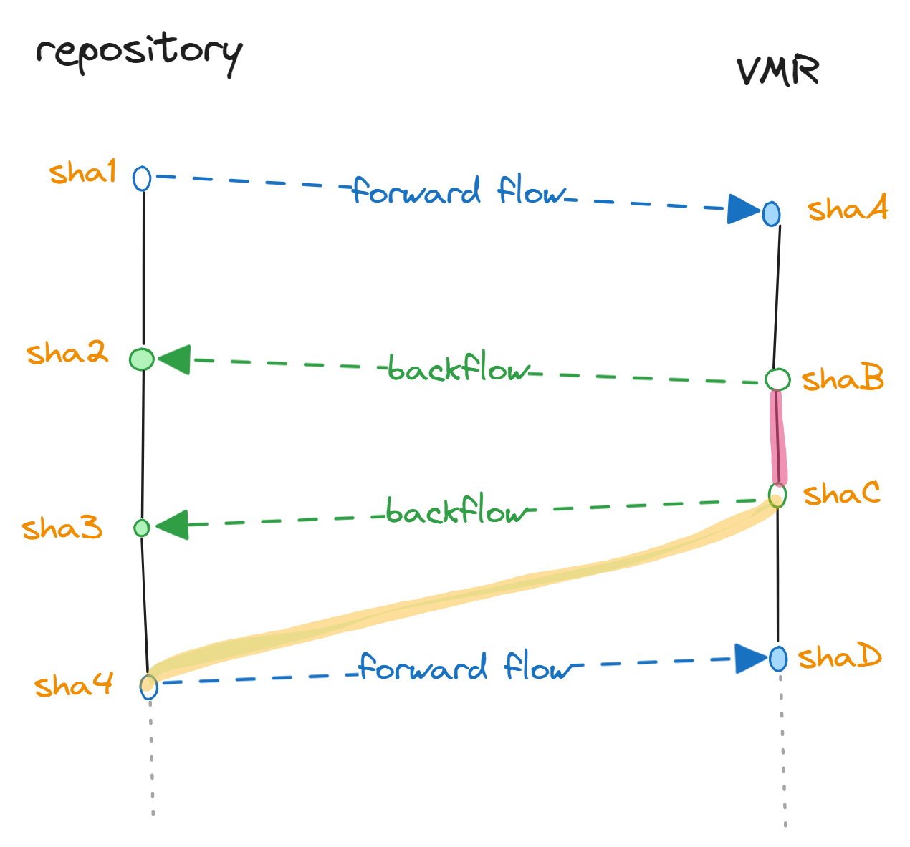
<p align="center">
  🖼️ Image #5 - Detecting flow direction
</p>

Let's assume we're at the point of wanting to open a flow PR from a given commit. To do that, we need to find out:
- Last points of synchronization in source and target repositories
- Base commit in the target repository

#### Detecting incoming flow

Let's assume we want to open a forward flow PR from commit `sha4`. To create the PR, we need the find out that:
1. `shaC` backflowed to `sha3`.
2. No other flow happened after that.

We can deduce this information easily from:
1. `Version.Details.xml` in `sha4` (our starting point) contains `shaC` as the last synchronized commit from the VMR.
2. `source-manifest.json` in the destination VMR commit contains a commit older than `sha3`.

`shaC` will then be both the base commit of the PR branch and also the commit we will be creating the diff (shown in yellow) against as you can see if you compare this simplified diagram to the "Forward flow after backflow" one above.

#### Detecting outgoing flow

Now let's assume we're trying to backflow from `shaC`, creating `sha3`. This time, we need to find out that:
1. `shaB` backflowed to `sha2`.
2. No other flow happened after that.

We can deduce this information easily from:
1. `Version.Details.xml` in `sha2` (our destination point) has `shaB` as the last synchronized commit from the VMR.
2. `source-manifest.json` in `shaC` (our starting point) VMR commit contains `sha2`.

We will then use the `shaB`-`shaC` diff (in pink) as the diff for the PR while basing the PR branch off of `sha2` (last known place we backflowed into).

#### Cases when SHA is not in the graph

It can happen that the SHA we find in the `Version.Details.xml` or `source-manifest.json` is not in the history of the current repository's branch tip. This can happen when we synchronize an off-branch commit or when the commit comes from a different repository entirely (e.g. internal fork). This could also happen when we fork a release branch earlier in the repo than the VMR and the VMR release branch receives a commit from the main branch that we don't have in the release branch in the repository.

Example of such a situation is shown here:

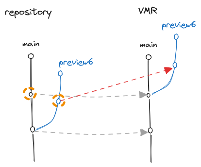

In such cases, the algorithm detects that the currently synchronized commit is not an ancestor of the previously synchronized one and errors out. A human intervention is then required to resolve the situation - specifically resetting the VMR's release branch to match the repository.

## Handling conflicts

Conflicts will happen and the goal of the process is to:
1. Make the conflicts visible in the flow PR so that developers need to resolve them.
2. If a conflict occurs and gets resolved in one side, the next flow from that side should bring the resolution to the other side.
3. The PR description / comments made by the system should point to the points of friction (e.g. conflicting commits) so that developers have an easier time resolving them.

### Conflict example

Outside of the very obvious conflicts where a particular file is changed in both repositories, there are some more interesting cases that can happen. For instance, in the following example, a conflict is introduced by a commit that was made in the forward flow PR but not in the repository. This is a common situation when the forward flow PR contains some additional changes that are not present in the repository.

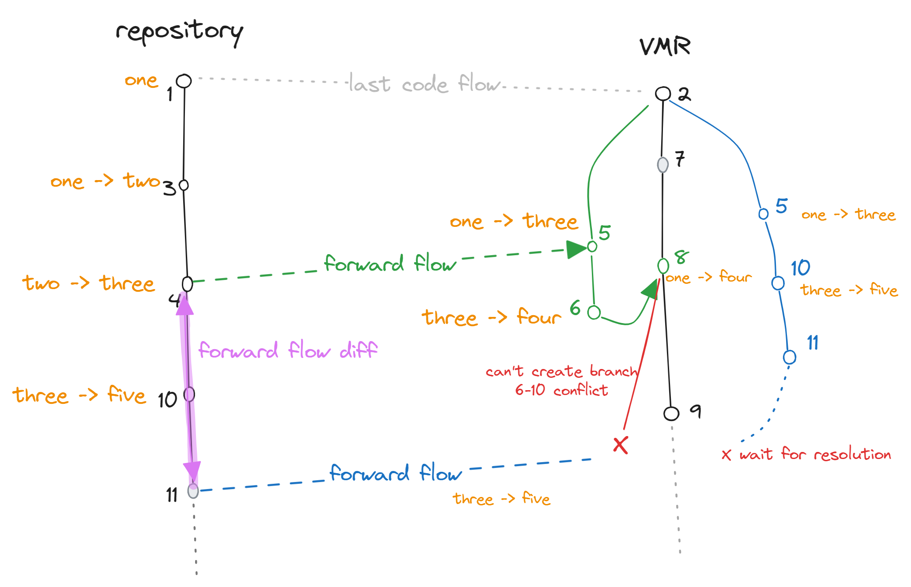
<p align="center">
  🖼️ Image #6 - Two flow in a row with a conflict
</p>

In this diagram, the additional commit that was made in the first forward flow PR (`6`) conflicts with a commit made in the repository (`10`). Since there was no backflow, this information is inaccessible by the repository.  
The follow-up forward flow is problematic because `10` and `11` cannot be applied on top of `8` so we are not able to even create the PR branch.  
In such a case the only thing left to do is to base the PR branch on the last known good commit (`2`), re-apply `5` (which is technically `1`, `3` and `4`), apply `10` and `11` on top and create a PR branch that will be conflicting with the target branch because of the `6`/`10` conflict.  
The user would then be instructed to merge the target branch (`9`) into the PR branch and resolve the conflict. The behaviour of git in this case is that the changes contained in `5` that are the same as the ones in `8`, will transparently match up and only the actual conflicting files will be left for resolution.  
The next backflow will then bring this resolution over to the repository.  
The downside is that before the target branch is merged into the PR branch, users will see changes in the PR that were previously only merged into the VMR as part of `8`. Those changes will disappear from the PR once the branch is merged.

There are countless other examples of conflicts that can occur but these will usually manifest as conflicts in the PR. The example above is more interesting because the forward flow is unable to even create the PR branch. This is due to the fact that `8` (the previous forward flow commit) contains `6` which is something extra.

### Conflicts during PR updates

Once a code flow PR is opened, if a new build from the source repository is produced, we need to update the PR with the new changes.
The code flow algorithm will again try to handle this situation seamlessly as it will detect the previous flow, which it made to create the PR, and apply the new changes on top of it.  
However, it could happen that developers pushed additional commits into the PR branch to fix some issues. These can get in conflict with the new updates. In such a case, the flow will stop, PR will receive a comment mentioning the conflict and developers will have to merge the PR before the flow can continue. After the PR is merged, a new PR will appear, based on an older commit and conflicting with the merged commit so that developers can resolve the conflict properly.

## Parallel flows

We can expect that at any given time it is likely that we will have PRs open in both ways at the same time. Either of them can merge first while the other is still opened. We need to then make sure that the flows account for this.

A sample situation can be seen here (again events happening in the order of the numbers):

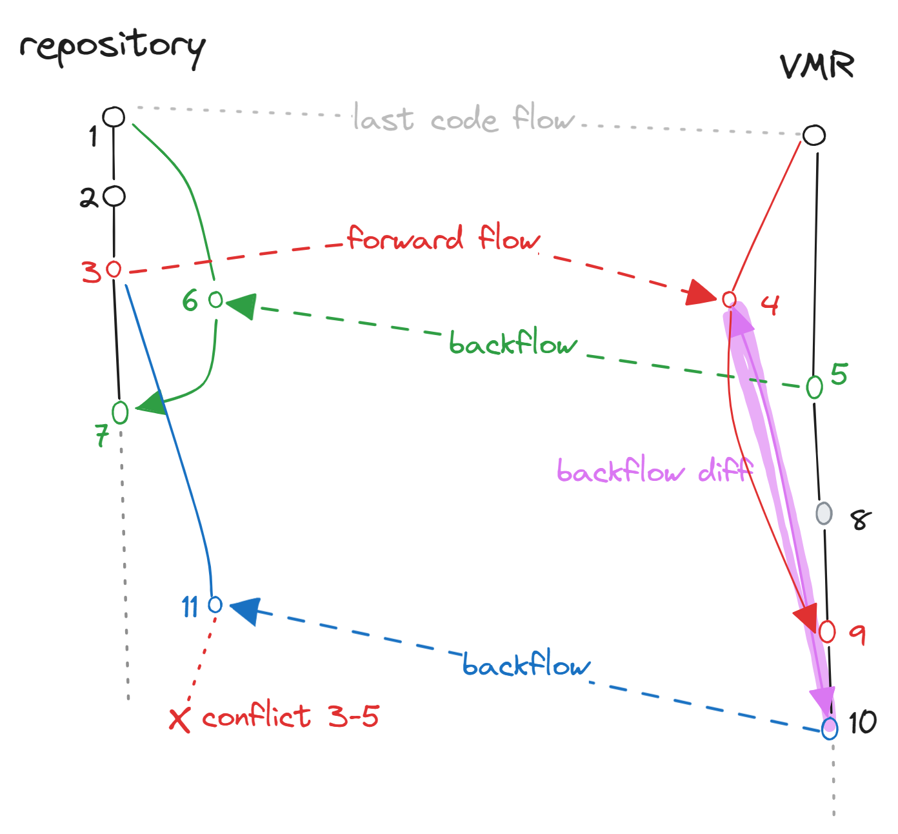

What we can see is that while the red forward flow PR was still open, the green backflow merged. The next backflow (blue) will then apply the same algorithm as before (shown in purple).  
The resulting PR branch will be in conflict with repository's target branch because `5` will clash with `7` but a simple merge would resolve this transparently just as we've seen with the conflict scenario mentioned above.
Outside of this, the purple diff contains all it needs (`8` and `10`) to bring the repository up to date. If additional changes were made in the forward flow PR (between `4` and `9`), those would be accounted for too - same as in the previous scenarios.

### Conflicts caused by parallel flows

The fact that we will have parallel flows together with the fact that conflicts can be introduced in any of the codeflow PRs means that the the algorithm might end up producing conflicts which should not be there. Consider the following example:

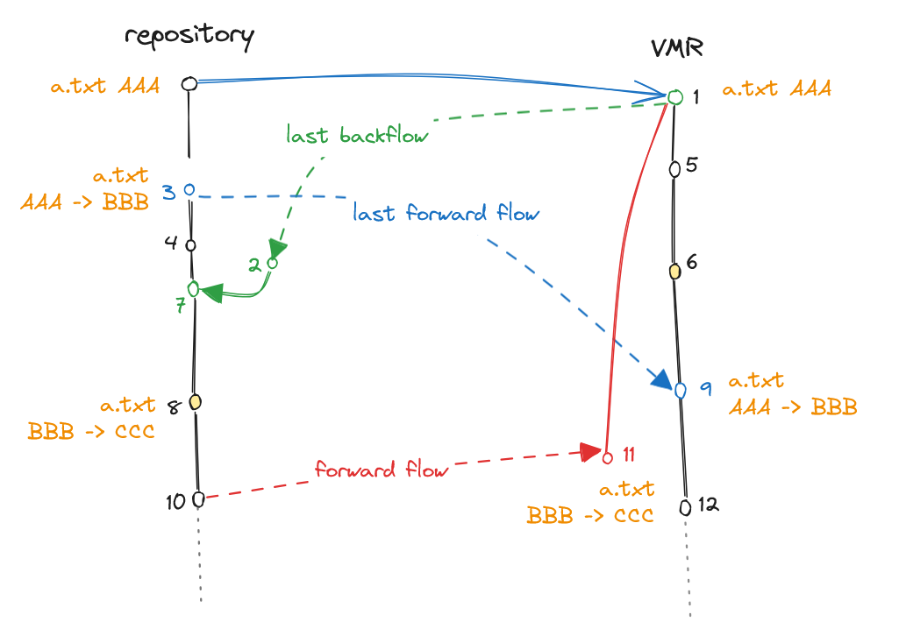

In the diagram above,  there is a file whose content is gradually being changed: `AAA` -> `BBB` -> `CCC`. Technically, these changes come serially and from the point of view of the file, there are not conflicts. However, a conflict arises from the fact that the PR branch created in step `11.` clashes with changes from step `9.`
This happens because the forward flow branch created in step `11.` will be based on commit `1.` (last flow source commit), and the PR branch changing the file from `AAA` -> `CCC` while the target branch has `BBB` (step `9.`).
The patch `AAA` -> `CCC` doesn't apply cleanly on top of `BBB` and the algorithm will create a conflict in the PR branch. The user will then have to resolve the conflict by merging the target branch into the PR branch and resolving the conflict.

When creating the last forward flow branch (in red), we can leverage the fact that it is known to us that another flow (blue) happened since. We know that the blue flow changed the file from `AAA` to `BBB` and since then, our repo contains `BBB` to `CCC` change.
We can compare the file we're flowing with the version in the target branch by merging the target branch into our PR branch (`9.` to `11.`) which will create the conflict. We can try to take the file as it is in the target branch and apply the diff from the repo since the blue flow (`BBB` to `CCC`) on top of it. This will result in the file being changed from `BBB` to `CCC` and the conflict will be correctly resolved.
This ensures continuity of the file content and prevent most of the non-conflicts from manifesting.

### Arcade

#### Updating `eng/common`

The `eng/common` folder is currently hosted in the `dotnet/arcade` repository and copied to other repositories when they receive dependency updates from `dotnet/arcade`.
Since repositories will also accept dependency updates from the VMR, we will need to distribute this folder from there too.

The rules for managing `eng/common`:

- `dotnet/arcade` stays the home for this folder as the contents are tied to the Arcade version often.
- When code is flowing from arcade to the VMR, we treat it as any other code flow subscription, and just update `src/arcade`.
- The root `eng/common` folder in the VMR will be tied to the version of Arcade in the root `eng/Version.Details.xml`.
  Arcade will flow to VMR via a non-source-enabled subscription like it would be any other repository and thus update the root `eng/common` folder in the VMR.
- Any subscription from the VMR (code-enabled or normal) will contain `Microsoft.DotNet.Arcade.Sdk` as it is built as part of the VMR. During this:
  - The `src/arcade` folder will be used as the source of truth for version file updates (`eng/common`, `global.json`, ...).
  - The .NET SDK version updated in `global.json` will be updated based on VMR's root `global.json` instead of `src/arcade/global.json` as that is the real SDK that was used during the VMR's build.
    Repositories can opt out of this by setting the `pinned: true` property in their `global.json`.
- Repositories can opt-out from getting Arcade updates from the VMR by ignoring the `Microsoft.DotNet.Arcade.Sdk` package in their code flow subscription.

A diagram of how the code flow including the `eng/common` folder looks like:

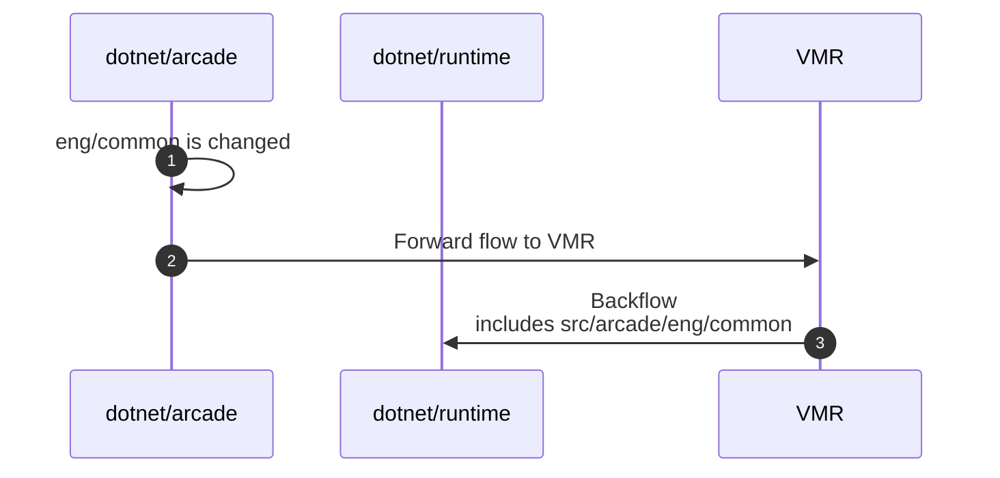

A diagram of a similar code flow but the `eng/common` change would happen in the VMR:

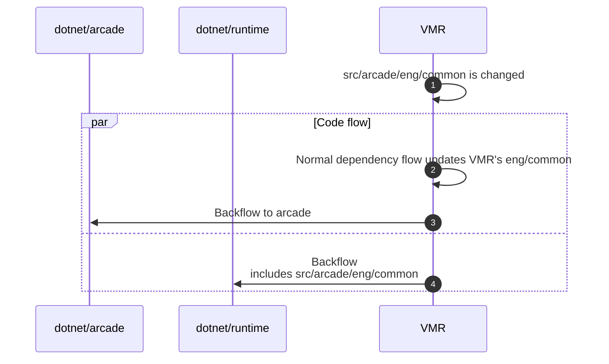
