# The Unified Build Almanac (TUBA) - Managing SDK Bands

## Purpose

This document describes how multiple .NET SDK bands are managed in the Unified Build world using the VMR (Virtual Monolithic Repository). This approach allows us to maintain multiple SDK versions that share common components while keeping band-specific components separate.

## Terminology

This section presents more precise definitions of common terms used in this document that may be prone to confusion. Also see the [Unified Build terminology](./Terminology.md) for more.

- **Individual/Source repository** – One of the current development repositories, e.g., `dotnet/runtime`. An "individual product repository" is then one that contains code for part of the product (but no individual repository contains code to build the whole .NET Core product).
- **VMR (Virtual Monolithic Repository)** – A repository containing code layout that produces the official build product of .NET Core. The repository contains individual product repositories plus tooling to enable a full build of the product.
- **VMR-lite** – present state where changes only flow one way into the VMR which is read-only.
- **Full VMR (Backflow)** – future final state where changes can be made in the VMR too and flow both ways. Dependency flow at that time will be only between VMR and individual repos, not between individual repos themselves.
- **Source-Build** – A set of sources and a process which allows to build the entire product end to end including all its dependencies in offline mode, excluding native dependencies from the source.
- **Microsoft build** – The current build methodology used to assemble the final product that Microsoft ships binaries from.
- **SDK branch** – A git branch related to a specific SDK band, e.g. `release/8.0.1xx`.
- **Non-SDK branch** – A git branch common for all associated SDK bands, e.g. `release/8.0`.
- **Build output packages** – Packaged build products of each of the individual repositories either built in their individual repo source-build or during the build of each individual repository component within the full VMR build. These are used during package flow between the VMR and the individual repositories, and in the VMR build itself.
- **Shared component** - A component that is shared between multiple SDK bands. For example, the .NET runtime is shared between all SDK bands.
- **Band-specific component** - The opposite of a *shared component*. A component whose version differs between SDK bands.
- **Maestro** - a service used by the .NET team to manage dependency flow between repositories.

## SDK bands

To align with new Visual Studio releases, .NET SDK updates sometimes include new features or new versions of components such as Roslyn or MSBuild. These new features or components may be incompatible with the versions that shipped in previous SDK updates for the same major or minor version. To differentiate such updates, the .NET SDK uses the concept of feature bands. While these bands differ in their feature set they share some common parts such as the .NET runtime.

### VMR Layout

The VMR uses SDK branches to manage different bands, similar to how individual repositories work today. Each SDK branch contains the appropriate sources for that band:

```sh
# release/9.0.1xx branch (100th band)
└── src
    ├── arcade
    ├── roslyn
    ├── runtime
    └── sdk

# release/9.0.2xx and other branches (non-100th bands)
└── src
    ├── roslyn # references the runtime and arcade build output packages instead of sources
    └── sdk # references the runtime and arcade build output packages instead of sources
```

**Key characteristics:**
- VMR has SDK branches, e.g. `release/9.0.1xx` and `release/9.0.2xx`
- Each repository is a folder under `src/` in the 1xx branch of the VMR
- Each non-1xx branch contains only band-specific repositories (e.g., roslyn, sdk)
- Shared components (runtime, arcade) exist as sources only in the 1xx branch
- Non-1xx branches reference shared components as build output packages from the 1xx branch

### Shared vs band-specific components

A shared component is a component that is shared between multiple SDK bands. For instance, the .NET runtime is a good example of a shared component while the Roslyn compiler would typically differ between bands.

During the development cycle, it can happen that shared components require band-specific changes and they can become band-specific for some time. Usually, this is a point in time event and the component becomes shared again after some time. A good example of this is the Arcade repository which contains build tools/infrastructure. However, there are no strict rules about this and it is possible that a component remains band-specific.

### Example

To best illustrate how SDK bands are developed and released in practice, let’s imagine the following timeline for repositories with SDK branches (e.g., `dotnet/sdk`):

```mermaid
%%{init: { 'gitGraph': {'showCommitLabel': false }}}%%
gitGraph
    commit
    commit
    branch release/8.0.1xx
    checkout release/8.0.1xx
    commit
    commit type: HIGHLIGHT tag: "Release #1 – SDK 8.0.100"
    commit
    checkout main
    commit
    commit
    commit
    checkout release/8.0.1xx
    branch release/8.0.2xx
    checkout release/8.0.2xx
    commit
    commit
    commit type: HIGHLIGHT tag: "Release #2 – SDK 8.0.205"
    checkout main
    commit
    checkout release/8.0.1xx
    commit type: HIGHLIGHT tag: "Release #2 – SDK 8.0.109"
    commit
    commit
    checkout main
    commit
    checkout release/8.0.1xx
    commit
    commit
    checkout release/8.0.2xx
    commit
    checkout release/8.0.1xx
    commit
    checkout main
    commit
    commit
    commit
    checkout release/8.0.2xx
    branch release/8.0.3xx
    checkout release/8.0.3xx
    commit
    commit
    checkout release/8.0.2xx
    commit type: HIGHLIGHT tag: "Release #3 – SDK 8.0.207"
    checkout release/8.0.1xx
    commit type: HIGHLIGHT tag: "Release #3 – SDK 8.0.111"
    checkout release/8.0.3xx
    commit type: HIGHLIGHT tag: "Release #3 – SDK 8.0.302"
    checkout main
    commit
```



In parallel, this would represent the state of a shared repository (e.g., `dotnet/runtime`) that is not specific to any particular SDK band:

```mermaid
%%{init: { 'logLevel': 'debug', 'theme': 'base', 'gitGraph': {'showCommitLabel': false, 'tagLabelFontSize': '24px'}} }%%
gitGraph
    commit
    commit
    branch release/8.0
    checkout release/8.0
    commit
    commit type: HIGHLIGHT tag: "Release #1 – Runtime 8.0.0"
    commit
    checkout main
    commit
    commit
    commit
    checkout release/8.0
    commit
    commit
    commit type: HIGHLIGHT tag: "Release #2 – Runtime 8.0.1"
    checkout main
    commit
    commit
    commit
    checkout release/8.0
    commit
    commit
    checkout main
    commit
    checkout release/8.0
    commit
    commit
    checkout main
    commit
    commit
    commit
    checkout release/8.0
    commit
    commit type: HIGHLIGHT tag: "Release #3 – Runtime 8.0.2"
    checkout main
    commit
    commit
```



On the image you can see timelines of branches of two different repositories – `dotnet/sdk` and `dotnet/runtime`. As noted previously, each (servicing) release of .NET may contain multiple SDK bands but **only** one runtime. Each individual repository of each component that needs to differ per band would then have these so-called *“SDK branches”* named `release/Z.0.Yxx` while repositories that are shared per release have the non-SDK `release/Z.0` branches. As shown in the example, the development of the single runtime would happen in the `release/8.0` branch while the various SDK bands are stored in the following SDK branches (e.g., `release/8.0.1xx` represents the “100th band”).

Once we hit each release day (denoted with red vertical lines), we take the latest commit of each of those branches (that already exist) and release those together. For the releases in the example diagram, these are the released compilations:

| Release |   Runtime   |               SDKs              |
|:-------:|:-----------:|:-------------------------------:|
|     #1  |     `8.0.0` |            `8.0.100`            |
|     #2  |   `8.0.1`   |       `8.0.109`, `8.0.205`      |
| #3      |   `8.0.2`   | `8.0.111`, `8.0.207`, `8.0.302` |

### Current code flow

To organize what ends up in each band and to drive the code flow between the repositories, we utilize the Maestro dependency flow, namely the Maestro channels (see [Channels, Branches and Subscriptions](../BranchesChannelsAndSubscriptions.md) for details):

- **VS-centric channels** – To better match how teams operate, some repositories align their build outputs with the Visual Studio versions, e.g. `dotnet/roslyn`. Outputs of repositories like that would end up in a channel named based on the version of VS, e.g. `17.5`.
- **SDK band channels** – The repositories that are closer to how we organize the final release are then targeting channels named based on the band version, e.g. `.NET 7.0.3xx SDK`.
- **Shared component channels** – Lastly, repositories with shared components and tooling repositories target channels named based on the major .NET version, e.g. `.NET 7` or `.NET 7 Eng`.

The following diagram shows a simplified example (some relationships are left out for brevity such as tooling leading to all repositories):


This setup makes sure that the latest version of each shared component (e.g., runtime) eventually flows to all SDK products. Over time, the SDK products become coherent. **We call the SDK bands coherent when the versions of all shared components of each band are the same**.

## Band lifecycle

The band lifecycle is tightly coupled with the releases of Visual Studio. The exception is the 100th band that ships on .NET's annual schedule and VS snaps to it. For repositories that target the VS-centric bands, the `main` branch usually targets the next VS version which is in preview. Once a version of VS is released (is GA-ed), we create a new branch named `dev/XX.Y` where `XX.Y` is the version of the released VS. The `main` branch then targets the next VS version in preview.

### Band phases

- **Product preview time**: The preview time is when most development happens and the VMR contains a single band only (the 1xx branch). Everything works the same way as with a single version.

- **Band preview time**: The band that is created latest and is to be released next is called the preview band. Except for the 1xx band, each preview band is locked down to use the latest released version of the shared components during development. Since non-1xx branches don't contain sources of shared components, it's clear that dependencies come from packages.

- **Band servicing**: Once a band is released, it moves into servicing mode where it receives updates from the shared component channels (like `.NET 9.0` channel) for runtime updates.

### Band snapping process

To create a new band, the snap is performed in the VMR and then flowed to individual repositories:

1. **Create the new branch** based off the current preview band
   - E.g., branch `release/9.0.3xx` from `release/9.0.2xx`

2. **Remove shared component sources** in the new branch
   - Remove sources of shared components (runtime, arcade, etc.)
   - Adjust package versions to point to build output packages from the last release

3. **Configure Maestro subscriptions** between new VMR bands and their individual repository counterparts

4. **Configure package flow** (when there are at least 3 bands)
   - Configure subscriptions for the currently released band to consume build output packages from the 1xx band

5. **Flow changes to individual repositories**
   - Maestro flows the changes from VMR and creates appropriate branches in individual repositories

This ensures that the new (preview) band is locked to use the latest released shared components and that newly released bands will start getting the newest shared components built in the 1xx branch.

### Example lifecycle

As an example, let's say we have the following setup:
- VS `17.1` is the latest stable version of VS and is associated with the `9.0.1xx` band
- VS `17.2` is in preview and is associated with the `9.0.2xx` band
- VS-centric repositories would have a `dev/17.1` branch targeting the `17.1` channel and a `main` branch targeting `17.2`
- The `17.1` channel would then flow into the `9.0.1xx` branches and the `17.2` channel would flow into the `9.0.2xx`
- The `9.0.1xx` branches would then flow into the `9.0.1xx` SDK channel and the `9.0.2xx` branches would flow into the `9.0.2xx` SDK channel
- The `9.0` channels would collect builds of shared repositories and flow into `9.0.Yxx` branches that are currently in servicing
- The `9.0 Eng` channels would collect builds of shared eng repositories and flow into their respective all `9.0.Yxx` branches, including previews

For this setup, we'd say the 100th band is in **servicing** and the 200th band is in **preview**. It is important to note that **while a band is in preview, it uses the most recently released .NET runtime** while **the servicing band revs with the `9.0` channel**.

When we would be ready to release VS `17.2`, we'd flow the latest shared components into the 200th band branches so that it becomes coherent with the 100th band. Then we'd release the coherent bands and after we would do the following:

- Create the `dev/17.2` branch in VS-centric repositories, point it to the `17.2` channel and retarget `main` to `dev/17.3`
- Snap branches of SDK repositories by branching `9.0.3xx` from `9.0.2xx`. While doing that, we'd update the runtime version of `9.0.3xx` to the just released version
- Set up the `9.0` shared channels to start flowing into the `9.0.2xx` branches as the runtime there would start revving

The important part is the alignment of repository's development branches with the Maestro channels.

## Code flow with VMR backflow

With the full VMR backflow model, individual repositories only receive and send updates from/to the VMR and not between each other, so the situation looks like this:


### Regular forward flow

A regular forward flow with changes going to the VMR only would look like this:

```mermaid
sequenceDiagram
    autonumber

    participant runtime as dotnet/runtime<br />release/9.0
    participant SDK_1xx as dotnet/sdk<br />release/9.0.1xx
    participant SDK_2xx as dotnet/sdk<br />release/9.0.2xx
    participant VMR_1xx as VMR<br />release/9.0.1xx
    participant VMR_2xx as VMR<br />release/9.0.2xx

    runtime->>runtime: New change ➡️ RUN_2

    runtime->>VMR_1xx: Flow of 📄 RUN_2
    Note over VMR_1xx: 📦 VMR_2 build output packages are built
    VMR_1xx->>VMR_2xx: Flow of 📦 VMR_2<br />(runtime build output packages)
    Note over VMR_2xx: 📦 VMR_3 build output packages are built

    Note over VMR_2xx: ✅ Coherent state<br />VMR 1xx and 2xx have 📄 RUN_2

    par Parallel backflow of build output packages
        VMR_1xx->>SDK_1xx: Backflow of 📦 VMR_2
    and
        VMR_2xx->>SDK_2xx: Backflow of 📦 VMR_3
    end
```



### Breaking changes flow

For breaking changes, the situation becomes more complex. Let's imagine a situation where a change is needed in one of the bands that requires a breaking change in a shared component:

```mermaid
sequenceDiagram
    autonumber

    participant runtime as dotnet/runtime<br />release/9.0
    participant SDK_1xx as dotnet/sdk<br />release/9.0.1xx
    participant SDK_2xx as dotnet/sdk<br />release/9.0.2xx
    participant VMR_1xx as VMR<br />release/9.0.1xx
    participant VMR_2xx as VMR<br />release/9.0.2xx

    runtime->>runtime: Change in runtime ➡️ RUN_2

    runtime->>VMR_1xx: PR with source change to 📄 RUN_2 is opened
    activate VMR_1xx
    Note over VMR_1xx: ❌ Requires a change in SDK
    VMR_1xx->>VMR_1xx: Change needed in src/sdk<br />Creating 📄 SDK_1.2
    deactivate VMR_1xx
    Note over VMR_1xx: 📦 VMR_2 build output packages are built

    VMR_1xx->>SDK_1xx: Flow of 📄 SDK_1.2, 📦 VMR_2

    VMR_1xx->>VMR_2xx: Flow of 📦 VMR_2
    activate VMR_2xx
    Note over VMR_2xx: ❌ Requires a change in SDK
    VMR_2xx->>VMR_2xx: Change needed in src/sdk<br />Creating 📄 SDK_2.2
    deactivate VMR_2xx
    Note over VMR_2xx: 📦 VMR_3 build output packages are built
    VMR_2xx->>SDK_2xx: Flow of 📄 SDK_2.2, 📦 VMR_3

    Note over VMR_2xx: ✅ Coherent state<br />VMR 1xx and 2xx both use 📄 RUN_2
```



This flow ensures that after breaking changes, all SDK bands become coherent by using the same version of shared components.

## Working with the code

The proposed layout has some problematic implications. Let's consider the following scenarios:

1. A developer needs to make sure a cross-repo change to `src/runtime` and `src/sdk` in the `3xx` band.
2. A distro maintainer needs to build the `3xx` band from source.

We need to make sure both of these scenarios are easy to do but the layout of the sources doesn't allow that out of the box.

It seems that to make this work, we'd need to be able to tell Source Build to easily swap between using the sources and the build output packages of the shared components.
When someone would be interested in these flows, we should have a mechanism to also checkout the sources and reference them during the build. There are couple of possibilities:

1. The `src/` folder of non-1xx branches would contain submodules pointing to the original individual repositories. These would not be used in most flows but could be activated. When we'd be flowing changes from the 1xx branch, we could also change where the submodule points.
2. Have a script that would check the components out into `src/` onto the same location where they are placed in the 1xx branch. It would also create some dummy file to signal that Source Build should ignore `Version.Details.xml` when restoring the build output packages but rather build the sources. The `src/` locations and the signal file would be ".gitignored". The dev would then have to backport their changes from withing the folders to either the 1xx branch or the individual repositories.
3. We could just expect the individual repositories to be checked out somewhere else on developer's disk (e.g. next to the VMR itself) and Source Build would know to find and build those instead (again through an invisible signal file for instance).

The first option seems quite straightforward but the individual repository doesn't necessarily have to have the same contents as its counterpart in the VMR which might be problematic.  
The second flow solves the scenario of .NET distro maintainers fully as we'd easily create a source tarball that would match the layout of the 1xx branch. It doesn't work well for the developer scenario though.  
The third option seems to be the best for the developer but doesn't solve the distro maintainer scenario fully.

It seems that we could have a mixture of `2.` and `3.` where Source Build would have a feature of "know to look elsewhere" and distro maintainers would build from a tarball assembled as described in `2.` and developers would have the option to use the sources from their local individual repositories as shown in `3.`.

### Building from source

For distro maintainers who need to build from source:

- **1xx band builds**: Contain all necessary sources and can be built directly
- **Non-1xx band builds**: Require assembling sources from the 1xx branch for shared components or using the mechanisms described above to swap from packages to sources

## Release process

The release process has three main phases:

### 1. Figuring out what to release

We need to ensure SDK branches are coherent, meaning all bands use the same versions of shared components. This requires:
- The latest published build output packages from the 1xx branch have flowed to all other SDK band branches
- Enabling package flow for the preview band to consume the newest bits
- Validating everything works together

### 2. Compiling the binary release

Since shared components are built only once and stored in build output packages, we can assemble packages from all band branches and release them together, similar to how we do it today. The staging pipeline assembles build products from official builds of each band.

### 3. Publishing and communicating the release of sources

Publishing sources for consumption by 3rd party partners differs based on consumer needs:

- **Single SDK band release**: Only the 1xx band branch contains sources that can be built directly. Non-1xx band branches don't contain source code of shared components and only reference them as build output packages. We need to compile sources by restoring them from the 1xx band branch.

- **Multiple SDK release**: We need to compile the full set of sources by bringing the branches together, ensuring shared components appear only once.

The release process ensures that shared components are built once officially and reused across all band builds, maintaining coherency while optimizing build times.

