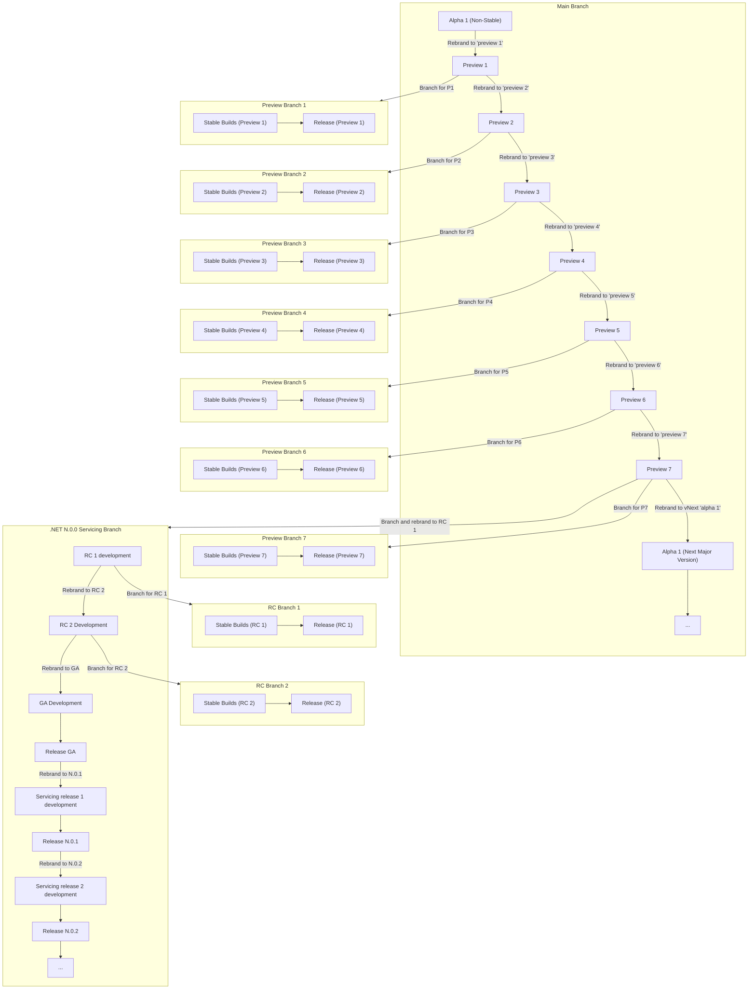

# The Unified Build Almanac (TUBA) - Product Versioning

## Purpose

This document details how the product is versioned over a given major version lifecycle.

## Terminology

This document uses the following terminology:
- **Branding** - Refers to the various product version information. Typically MAJOR.MINOR.PATCH, pre-release and build-varying versioning information if present.
- **Stable Branding** - Branding that does not include build-varying information in the version numbers for shipping components. A stable branded component may still have pre-release information. Examples:
  - 10.0.0 - Stable
  - 10.0.25172 (patch varies build to build based on date+revision) - Non-Stable
  - 10.0.0-preview.2 - Stable
  - 10.0.100-preview.2.1234.5 - Non-Stable

## NuGet, Runtime and SDK Versioning Principles

### Major, Minor and Patch Versions

Most .NET components are versioned with a standard `MAJOR.MINOR.PATCH`, though since .NET Core 3.1, only the MAJOR and PATCH components are actively used. There is no plan to use MINOR version going forward. The MAJOR version is incremented for yearly releases that introduce breaking changes or significant new features that may not be backward compatible, while the PATCH version is incremented for releases that include only backward-compatible bug fixes or small improvements.

Repos that make up the .NET product may choose their own `MAJOR.MINOR.PATCH` versions, and there is no strict enforcement across components. However, .NET does ensure that shared frameworks have their MAJOR.MINOR.PATCH aligned. The .NET SDK shares a major and minor version with the shared frameworks, but uses the patch version to communicate SDK band. SDK bands start at 100 for the patch version. Each new SDK band starts at the next multiple of 100 (for example, 200, 300, etc.).

Additionally, some packages released by .NET may have versioning that does not align with the runtime version, or does not conform to SemVer2 standards. For instance, global tools often use a 3 part version, where the patch is determined by the date+build revision (e.g. 9.0.621003)

### Pre-release information

Pre-release information is included in version numbers for a given asset, if any of the following is true:
- The asset is non-shipping
- The asset is pre-GA (e.g. a release candidate, a preview, etc.)

Pre-release information may also be included for components that do not ship via the .NET release process. This is typically done to avoid complexity around managing conflicts between stable branded assets, when that stable branding is not required for product functionality. For instance, roslyn always inserts packages with pre-release branding into the SDK, because the binaries are just redistributed.

When pre-release version information is included in a version number, this pre-release information takes the form of a pre-release label (e.g. 'preview'), an optional pre-release iteration (e.g. '2'), and the optional 'build identifier' information that is determined by the official build ID. The official build ID uses the format `YYYYMMDD.Revision`. For VMR builds, the `Revision` starts at 101.

### Stable Branding

The .NET product switches a subset of its assets to stable branding at certain points in the product lifecycle. Stable branding indicates that no build-varying information is included in the version of an asset. Two successive builds of the same code with different official build IDs will produce the asset with the same version number. This stable branding is used for the following reasons:

#### Customer UX

A simple version number is easier to understand/address than a more complex one.

#### Compatibility with distributions not built by Microsoft

All builds of .NET have strong version dependencies between components. For instance, a package dependency references a specific version of another package. When stable branding is not in use, two successive builds of .NET with different official build IDs will have different package versions for System.Text.Json.

Therefore any references to System.Text.Json will also vary. This means that builds of .NET with different official build IDs will not necessarily work seamlessly with each other. This is an important consideration when we recognize that Microsoft is *not* the only builder of .NET. Our Linux distro partners also build their own SDKs and runtimes, and those SDKs and runtimes have dependencies on assets produced by Microsoft (e.g. packages on nuget.org).

In order for external partners to produce distributions that are compatible with Microsoft's, we need to either communicate the build-varying information to them (the official build ID), or we need to use stable branding to ensure that the build-varying information does not influence product functionality.

#### Changes in .NET 10

In .NET 10, preview releases will be stable branded. This is to ensure cross-distribution compatibility, as noted above.

## Version Progression during the .NET product lifecycle

## Open questions

There are a few open questions that may require some experience before settling on a final answer:

### How should branding be updated? Centrally in VMR or individual repos?

Branding has been historically updated in individual repos. With the VMR, we could now do branding centrally, checking in an update in a single commit.

**Proposal: Update branding centrally in the VMR and backflow to repos**

### Should stable branding be 'checked-in'?

In the past, we would activate stable branding for a repository by changing its Versions.props. All future builds of that branch would be stable. The VMR now has options to queue a build with stable branding. Does stable branding need to be checked in any longer? Or can it just be activated on-demand with a switch?

**Proposal: Check-in stable branding in preview and servicing branches. This ensures that rolling CI is producing the stable bits required for release at all times.**

### If checked in, how should stable branding be activated?

There are options in the VMR build pipeline to activate stable branding (preview or rtm release branding) via pipeline parameter. In addition, the stable switches could also be activated in the VMR repo-project Directory.Build.props, or individual repo Versions.props.

**Proposal: Use YAML pre-processor directives to change defaults for stable branding to produce 'prerelease stable' in release/preview.N or release/rc.N, and 'rtm stable' in release/N, and non-stable everywhere else.**

