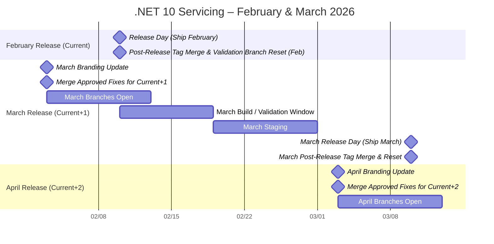
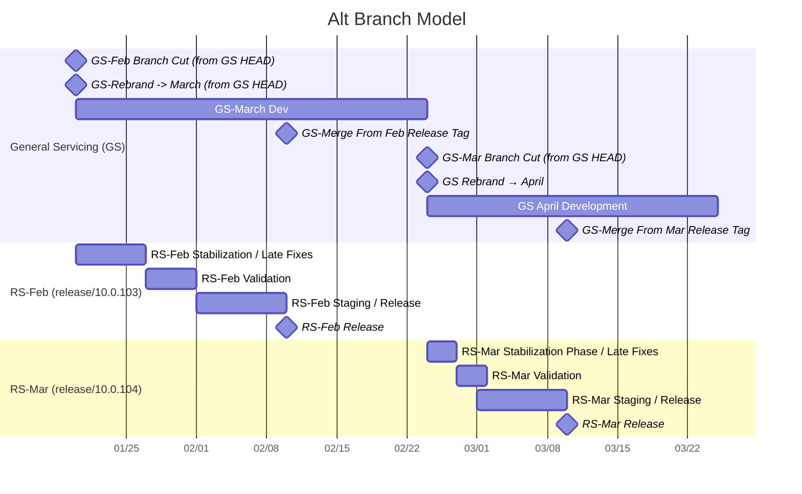

# The Unified Build Almanac (TUBA) - Servicing Workflow

The information below represents potential options for branching and branding strategies in servicing for 10.0.

Terminology for the info below:
- **Current Month** - The month being built, but not yet released.
- **Current+1 Month** - The next release after the current month.
- **Current+2 Month** - The next release after the current+1 month.
- **Release Specific** - Referring to a specific release, rather than an overall release train (e.g. release/10.0.101)
- **General Servicing** - Referring to an overall servicing train (e.g. release/10.0.1xx)

## Status Quo (.NET 9 and prior) Approach

The status quo approach closely matches the workflow used today in servicing, with some differences that are required due to different workflow with the VMR.
- Tactics approves bugs continuously. These bugs are approved for a specific release (milestone) based on whether we have reached code complete for the **Current Month**
- On a specified day after the **Current Month** has been signed off on and is on its way out the door, the public VMR branches (`release/10.0.Nxx`) are rebranded to the **Current+1 Month**'s release.
- The internal component repo validation branches (e.g. sdk @ validation/release/10.0.1xx) are force-reset to the last forward flow of the corresponding
  component repositories of the internal VMR branch (which should match the public).
- After rebranding for **Current+1 Month**, branches are now open for changes. Approved changes for the **Current+1 Month** are checked into the following locations:
  - Public component repo branches (e.g. sdk @ release/10.0.1xx, runtime @ release/10.0) - Flows to public VMR (release/10.0.Nxx) via forward flow.
  - Public VMR branches (`release/10.0.Nxx) - For public VMR fixes
  - Internal VMR branches (`internal/release/10.0.Nxx) - For internal fixes.
- Changes in the public VMR branches automatically merge into the internal VMR branches (release/10.0.Nxx->internal/release/10.0.Nxx). This happens on a continuous basis.
- Automated validation for changes is provided in the following ways:
  - Public forward flows from component repositories receive validation on the public PRs to those component repositories (e.g. my-fix-12345 is validated before merge to runtime @ release/10.0)
  - Public VMR-targeted changes are validated before merge via the VMR PR pipelines and scenario testing.
  - Internal VMR-targeted changes are validated before merge via the VMR PR pipelines and scenario testing.
  - Internal component repository changes may be validated before cherry-picking into the VMR by PRs against the internal validation branches (e.g. runtime @ validation/release/10.0).
    These changes may be merged into the validation branch, but do not flow anywhere if they are.
  - Public VMR builds of servicing branches back flow to the public component repositories (e.g. builds of the VMR applying to channel .NET 10.0.1xx SDK backflow to runtime @ release/10.0 and sdk @ release/10.0.1xx).
    PR validation occurs on those backflows. This covers changes made solely in the VMR, as well as validation of the repo sources against the latest built packages of its dependencies.
  - Internal VMR builds of servicing branches back flow to internal component repository validation branches (e.g. runtime @ validation/release/10.0).
    These changes may be merged into the validation branch, but do not flow anywhere if they are.
- On the release day for the **Current Month**:
  - The VMR release tag is merged back into the public VMR release branch (e.g. tag v10.0.101->release/10.0.1xx, tag v10.0.200->release/10.0.2xx, etc.).
  - The VMR bootstrap SDK is updated (updated the version of the SDK used to build the VMR)
  - Arcade gets the new bootstrap SDK version, which would then flow out to component repositories.
- The **Current+1 Month** builds as new changes are merged into the VMR. Validation occurs as this happens via backflow, validation via the CTI teams, VS insertion, etc.
  Approved changes for **Current+1 Month** allowed as quality bar, risk, and time allows.
- Approved changes that do not meet the bar for **Current+1 Month** are marked with the **Current+2 Month** milestone.

### Pros

- Well-trodden servicing workflow
- Simplest dependency flow and code flow strategy
- Fewest places for devs to merge code.

### Cons

- Branches 'close' for a period of time while building **Current+1 Month**, but before branding for **Current+2 Month** is complete. This period allows for a stable, predictable branch while validation
  is completed. If critical changes are required for **Current+1 Month**, they can be made in component repositories or the VMR directly without inadvertently bringing in **Current+2 Month** changes.

### Diagrams

Schedule

## Alternative: Branch the VMR for release

This alternative utilizes a **continuously** open release branch. A new VMR **Release Specific** branch is created off of this release for each actual release (e.g. release/10.0.101 and release/10.0.200) with additional temporary validation branches. These new **Release Specific** branches may receive additional late breaking fixes without endangering a future release.

- Tactics approves bugs continuously. These bugs are approved for a specific release (milestone). Which release they are approved for may change depending on the bug. For instance, a bug might be approved, but delayed to align with another product's release. Changes are **immediately** checked into the branch that matches the milestone that the bug is approved for. This target would shift depending on where we were in the month.
- On a specified day after the **Current Month** content is code complete (validation may not yet be complete), **Release Specific** VMR and validation branches are created:
  - Public **Release Specific** VMR -> release/10.0.Nxx -> release/10.0.NOM off of HEAD
  - Internal **Release Specific** VMR -> internal/release/10.0.Nxx -> internal/release/10.0.NOM off of HEAD
  - Internal **Release Specific** VMR validation branches -> validation/release/10.0.N[0M] off of last last FF shas.
- **Current Month** changes then move to being checked in to the following locations:
  - Public **Release Specific** VMR branches (`release/10.0.NOM) - For public VMR fixes
  - Internal **Release Specific** VMR branches (`internal/release/10.0.NOM) - For internal fixes.
- The Public VMR branches are rebranded for **Current+1 Month**.
- After rebranding for **Current+1 Month** and until the next branch point, **General Servicing** branches are open for waiting **Current+1 Month** changes. While the **General Servicing** VMR branch represents **Current+1 Month**, **Current+1 Month** may checked into the following locations:
  - Public **General Servicing** component repo branches (e.g. sdk @ release/10.0.1xx, runtime @ release/10.0) - Flows to public VMR (release/10.0.Nxx) via forward flow.
  - Public **General Servicing** VMR branches (`release/10.0.Nxx) - For public VMR fixes
  - Internal **General Servicing** VMR branches (`internal/release/10.0.Nxx) - For internal fixes.
- Changes in the public VMR branches automatically merge into the internal VMR branches (release/10.0.Nxx->internal/release/10.0.Nxx). This happens on a continuous basis for both **Release Specific** and **General Servicing**.
- Automated validation for changes is provided in the following ways:
  - **General Servicing** - Public forward flows from component repositories receive validation on the public PRs to those component repositories (e.g. my-fix-12345 is validated before merge to runtime @ release/10.0)
  - **General Servicing** and **Release Specific** - Public VMR-targeted changes are validated before merge via the VMR PR pipelines and scenario testing.
  - **General Servicing** and **Release Specific** Internal VMR-targeted changes are validated before merge via the VMR PR pipelines and scenario testing.
  - **General Servicing** and **Release Specific** - Internal component repository changes may be validated before cherry-picking into the VMR by PRs against the internal validation branches (e.g. runtime @ validation/release/10.0 and sdk @ validation/release/10.0.202).
    These changes may be merged into the validation branch, but do not flow anywhere if they are.
  - **General Servicing** Public VMR builds of **General Servicing** branches back flow to the public **General Servicing** component repository branches (e.g. builds of the VMR applying to channel .NET 10.0.1xx SDK backflow to runtime @ release/10.0 and sdk @ release/10.0.1xx).
    PR validation occurs on those backflows. This covers changes made solely in the VMR, as well as validation of the repo sources against the latest built packages of its dependencies.
  - **General Servicing** and **Release Specific** - Internal VMR builds of servicing branches back flow to internal component repository validation branches (e.g. runtime @ validation/release/10.0 and runtime @ validation/release/10.0.2).
- On the release day for the **Current Month**:
  - The VMR release tag is merged back into the public **General Servicing** and **Release Specific** VMR release branches (e.g. tag v10.0.101->release/10.0.1xx, tag v10.0.200->release/10.0.2xx, tag v10.0.101->release/10.0.102, tag v10.0.200->release/10.0.201).
  - The VMR bootstrap SDK is updated (updated the version of the SDK used to build the VMR) in the **General Servicing** branch.
  - Arcade gets the new bootstrap SDK version, which would then flow out to component repositories.
- Approved changes that do not meet the bar for **Current+1 Month** are marked with the **Current+2 Month** milestone.

### Pros

- **General Servicing** is always open.
- Roughly similar to current servicing workflow.
- Relatively simple branch and flow setup.

### Cons

- Devs need to know where to check-in to meet the current release. If the **Release Specific** branch point is too early, then this could be an issue.
- Some fixes might have to wait for check-in if they are not approved for a release that has an active branch.
- For late-breaking changes, there is no forward flow.

### Diagrams

