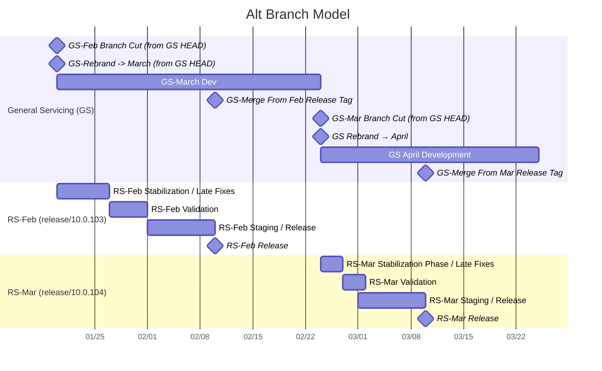
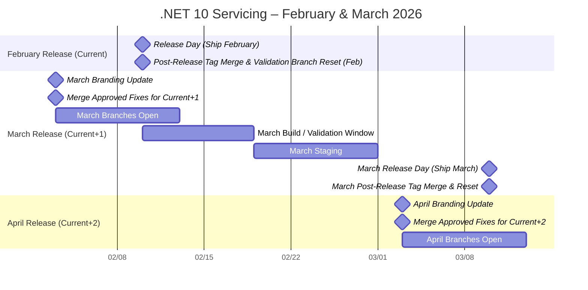

# The Unified Build Almanac (TUBA) - Servicing Workflow

This document describes the workflow for branching, branding, and build management in servicing for 10.0. An alternative model is included later for comparison.

Terminology for the info below:
- **Current Month** – The month being built, but not yet released.
- **Current+1 Month** – The next release after the current month.
- **Current+2 Month** – The next release after the current+1 month.
- **Release Specific** – Refers to a specific release, rather than an overall release train (e.g. `release/10.0.101`).
- **General Servicing** – Refers to an overall servicing train (e.g. `release/10.0.1xx`).

## Branch the VMR for each release

Utilizes a **continuously** open servicing branch. A new VMR **Release Specific** branch is created off of this branch for each actual release (e.g. `release/10.0.101` and `release/10.0.200`) with additional temporary validation branches. These **Release Specific** branches may receive late-breaking fixes without endangering a future release.

### TL;DR

- Release builds are cut from short-lived servicing branches.
- Long-lived servicing branches are always open.
- Day-to-day validation occurs against long-lived validation and repository branches.
- Final validation occurs against short-lived servicing branches.
- Developers switch where they check in based on the point in time during the month.

### Detailed Description

- Tactics approves bugs continuously. These bugs are approved for a specific release (milestone). The target release may change (e.g., delayed to align with another product). Changes are **immediately** checked into the branch that matches the milestone, if it exists. This target shifts depending on where we are in the month.
- On a specified day after the **Current Month** content is code complete (validation may not yet be complete), **Release Specific** VMR and validation branches are created:
  - Public **Release Specific** VMR: `release/10.0.Nxx` -> `release/10.0.NOM` (off HEAD)
  - Internal **Release Specific** VMR: `internal/release/10.0.Nxx` -> `internal/release/10.0.NOM` (off HEAD)
  - Internal **Release Specific** VMR validation branches: `validation/release/10.0.N[0M]` off the last forward-flow SHAs.
- **Current Month** changes then move to being checked into the following locations:
  - Internal **Release Specific** VMR branches (`internal/release/10.0.NOM`) – for all VMR fixes.
- The Public VMR branches are rebranded for **Current+1 Month**.
- After rebranding for **Current+1 Month** and until the next branch point, **General Servicing** branches are open for **Current+1 Month** changes. While the **General Servicing** VMR branch represents **Current+1 Month**, changes for **Current+1 Month** may be checked into the following locations:
  - Public **General Servicing** component repository branches (e.g., SDK @ `release/10.0.1xx`, runtime @ `release/10.0`) – flows to public VMR (`release/10.0.Nxx`) via forward flow.
  - Public **General Servicing** VMR branches (`release/10.0.Nxx`) – for public VMR fixes.
  - Internal **General Servicing** VMR branches (`internal/release/10.0.Nxx`) – for internal fixes.
- Changes in public **General Servicing** VMR branches automatically merge into internal **General Servicing** VMR branches (`release/10.0.Nxx` -> `internal/release/10.0.Nxx`). This happens continuously for **General Servicing** branches.
- Automated validation for changes is provided in the following ways:
  - **General Servicing** – Public forward flows from component repositories receive validation on the public PRs to those repositories (e.g., `my-fix-12345` validated before merging to runtime @ `release/10.0`).
  - **General Servicing** – Public VMR-targeted changes are validated before merge via VMR PR pipelines and scenario testing.
  - **General Servicing** and **Release Specific** – Internal VMR-targeted changes are validated before merge via VMR PR pipelines and scenario testing.
  - **General Servicing** and **Release Specific** – Internal component repository changes may be validated before cherry-picking into the VMR via PRs against internal validation branches (e.g., runtime @ `validation/release/10.0`, SDK @ `validation/release/10.0.202`). These changes may be merged into the validation branch but do not flow further.
  - **General Servicing** – Public VMR builds of servicing branches backflow to the public **General Servicing** component repository branches (e.g., builds of the VMR applying to channel .NET 10.0.1xx SDK backflow to runtime @ `release/10.0` and SDK @ `release/10.0.1xx`). PR validation occurs on those backflows. This covers VMR-only changes and validates component repository sources against the latest built dependency packages.
  - **General Servicing** and **Release Specific** – Internal VMR builds of servicing branches backflow to internal component repository validation branches (e.g., runtime @ `validation/release/10.0` and runtime @ `validation/release/10.0.2`).
- On the release day for the **Current Month**:
  - The product is released.
  - The VMR release tag is merged back into the public **General Servicing** and **Release Specific** VMR release branches (e.g., `v10.0.101` -> `release/10.0.1xx`, `v10.0.200` -> `release/10.0.2xx`, `v10.0.101` -> `release/10.0.102`, `v10.0.200` -> `release/10.0.201`).
  - The VMR bootstrap SDK is updated (the version of the SDK used to build the VMR) in the **General Servicing** branch.
  - Arcade gets the new bootstrap SDK version, which then flows to component repositories.
- Approved changes that do not meet the bar for **Current+1 Month** are marked with the **Current+2 Month** milestone.

### Pros

- **General Servicing** is always open.
- Roughly similar to current servicing workflow.
- Relatively simple branch and flow setup.
- Because **General Servicing** is always open and building regularly as new fixes are approved and merged, there is a higher chance of catching infrastructure rot before it causes schedule pressure.

### Cons

- Developers need to know where to check in to meet the current release. If the **Release Specific** branch point is too early, this could be an issue.
- Some fixes may have to wait if they are not approved for a currently active branch.
- For late-breaking changes, there is no forward flow.
- Care is required around branch time to ensure all approved fixes make it into the VMR before the branch point. For example: a runtime fix is approved, checked into the runtime repo, and begins flowing into the VMR via a PR. If the release branch is cut before that PR merges, the fix misses the release. Tooling can mitigate this risk. *Note: A similar situation exists today; long-lived branches likely reduce the chance of missing a change.*

### Sample Schedule


#### Notes on schedule

- Choosing the RS branch day is a key component. The branch day should balance the following:
  - **Late enough** to avoid requiring devs to switch check-in targets as much as possible (devs should primarily care about GS branches).
  - **Early enough** to avoid 'parking' too many approved fixes while waiting for the matching GS branch to open.

#### Developer – Public Fix

1. Developer prepares source for their fix in their component repository, or in the VMR if the fix is VMR-specific.
2. Developer prepares an approval template and brings the fix to Tactics.
3. Tactics approves the bug for a specific release (e.g. 10.0.3 or 10.0.4)
4. Developer merges the fix based on the current branch status and schedule, choosing the appropriate place to check in:
    - If the approved milestone corresponds to the **Release Specific** branch, then the PR is targeted to the internal VMR **Release Specific** branch and merged.
    - If the approved milestone corresponds to the current state of the **General Servicing** branch (the branch is branded for that milestone), then the PR is targeted to the public VMR **General Servicing** branch, or the component repository **General Servicing** branch and merged.
    - If the approved milestone does not correspond to any currently open branch, the fix is parked until a **General Servicing** VMR/component repo branch matches the milestone, and then the fix is merged.
5. Confirm that the fix flowed into the VMR servicing branch matching the approved milestone.
6. Wait for a validation build.
7. Validate the fix in the shipping product.

#### Developer – Internal Fix

1. Developer prepares source for their fix. This can be done in two ways:
  - In the internal validation branch of their component repository (to enable repo-specific PR validation), followed by cherry-picking to the internal VMR servicing branch.
  - Directly in the internal VMR servicing branch.
2. Developer prepares an approval template and brings the fix to .NET Tactics.
3. Tactics approves the bug for a specific release (e.g. 10.0.3 or 10.0.4)
4. Developer merges the fix based on the current branch status and schedule, choosing the appropriate place to check-in:
    - If the approved milestone corresponds to the **Release Specific** branch, then the PR is targeted to the internal VMR **Release Specific** branch and merged.
    - If the approved milestone corresponds to the current state of the **General Servicing** branch (the branch is branded for that milestone), then the PR is targeted to the internal VMR **General Servicing** branch and merged.
    - If the approved milestone does not correspond to any currently open branch, the fix is parked until a **General Servicing** internal VMR branch matches the milestone, and then the fix is merged.
5. Confirm that the fix made it into the VMR servicing branch matching the approved milestone.
6. Wait for a validation build.
7. Validate the fix in the shipping product.

#### Repository Owner - Preparing for Upcoming Release

1. Continually review approved fixes. Ensure that any approved fixes are merged to a branch that matches their milestone.
2. Before the **Release Specific** branch date, ensure that all approved fixes have been merged into the VMR **General Servicing** branch. *Note: Tooling for this will be available*.
3. After **Release Specific** branching, ensure that fixes approved for the milestone matching the **Release Specific** VMR branch are merged into the **Release Specific** branch.

#### Repository Owner – Release Sign-off

1. Regularly review status of **General Servicing** validation flows. The status of these branches represents the future shipping release before **Release Specific** branching is completed.
  - Public and internal validation PRs should be passing
2. Receive release candidate build for signoff, typically via the [release tracker](https://aka.ms/release-tracker) or signoff mails sent to Tactics.
3. Ensure that expected shas and fixes from component repository are included in the build via inspection of the release tracker metadata, BarViz, or the VMR src/source-manifest.json file.
4. Perform validations on component scenarios. This may include validations for specific fixes as well as general scenarios.
5. Review status of internal **Release Specific** backflow validation PRs to your component repository.
  - PRs should be passing.
  - Backflow should be from latest internal VMR build (release candidate, or later if additional builds were completed.)
6. Review additional rolling CI jobs as per repository validation requirements (e.g. rolling gcstress)

#### Coherency QB Tasks

The coherency QB would be called upon to complete the following tasks:

##### Update branding, create internal validation branches

On branding update day, the coherency QB will update branding to the next version via the VMR and create **Release Specific** internal validation branches. This will use the NETMechanic tool.

```
# Exact command TBD. Command NYI.
NETMechanic.dll prepare-for-servicing --config net10.json --previous-release-sha 12345 --next-release 10.0.1,10.0.103,10.0.200
```

##### Merge in internal release tags

On release day, the coherency QB will merge internal release tags to the public branches. This will use the NETMechanic tool.

```
# Exact command TBD. Command NYI.
NETMechanic.dll merge-latest-release-tags --config net10.json
```

#### Coherency QB/Release QB/Repository Owners/Devs - Ensure desired changes are in build.

Various parties may want to validate that a set of approved fixes from a specific milestone exist in the VMR build. .NET will invest in mechanisms to ensure that all intended fixes make it from their source locations into the validated build. This includes:
- [Services Approved Fixes Tooling](https://github.com/dotnet/release/issues/1586)
- [Linking PRs in forward flows](https://github.com/dotnet/arcade-services/pull/5355)

### Special Considerations - Cherry-pick Release Specific to General Servicing?

When a fix is made directly to a **Release Specific** branch, that fix will make its way back into **General Servicing** on release day, when the VMR tag is merged in. However, this is primarily an insurance measure, and cannot account for:
- Additional special case **Release Specific** branches created before the release day.
- The **General Servicing** branch not having a fix required for release available in daily validation.
- Current infrastructure issues in the **General Servicing** branch resolved by the fix.

It is recommended, though not required, that fixes made directly to the **Release Specific** VMR branch be merged back into the appropriate **General Servicing** branch (public->public, internal->internal).

### Special Considerations - OOB Releases

There are times when an OOB release is required. These are releases that contain a minimal set of fixes with new branding. These typically come in two forms:
- A full release that includes a new runtime and new SDKs. The current in-progress release becomes N+1.
- An SDK-only release. The SDKs move forward to N+1.

#### Process

- Tactics decides that an OOB release is required.
- Tactics defines the content of this OOB release. This includes:
  - **Release Base** – What is the basis for the release? (e.g., an SDK-only OOB after January might base off the unreleased .NET 10.0.102 SDK.)
  - **Release Versioning** – What version should this release use, and how does that affect in-flight versions?
  - **Release Scope** – Which components are released?
  - **Release Content** – Additional content or changes required:
    - Required fixes (may include the primary fix plus any supporting fixes such as NuGet thumbprint updates).
    - Ancillary changes (e.g., implicit versions).
- Based on the release base and content, the coherency QB chooses a branch point. This is *usually*, but not always, the previous (or soon-to-be-released) VMR SHA.
- The coherency QB performs the branching and branding process (roughly equivalent to the monthly branching process), possibly with an additional step to move in-process release branding forward.
  - Rebrand and rename any active **Release Specific** branches that need to change based on the introduction of a new release. For example, if an SDK-only OOB for 10.0.102 is to be released and `release/10.0.102` already exists, that branch is rebranded and then renamed to `release/10.0.103`. Typically, versions increase by 1 to leave space. The original `release/10.0.102` is deleted (it will be recreated with new content).
  - Rebrand any active **General Release** branches that need updating (typically increment the patch version by 1).
  - Use the `NETMechanic` tool to create a new **Release Specific** VMR branch with associated validation branches from the desired VMR base sha.
  - As necessary, update **Release Specific** branch(es) to match desired release scope. (E.g., for an SDK-only 1xx release, disable the runtime build.)
  - Update content in the **Release Specific** VMR branch to match approved content. This may include:
    - *SDK-only releases*: Update to required runtime.
    - Approved fixes
    - Implicit versions
    - ...
  - As necessary, update in-progress releases to ensure that they will have the required content. This typically involves integrating the OOB release fixes into the **General Release** and **Release Specific** branches.
- Build the release and perform validation (see sign-off tasks for more info).
- On release day:
  - Release the OOB.
  - Merge the VMR OOB release tag back into the **General Release** VMR branch.
  - If there is still runway, merge the tag back into yet-unreleased **Release Specific** VMR branches.

## Alternative considered - General Servicing branches only

This approach closely matches the workflow used in 9.0 and prior releases, with adjustments required due to the VMR workflow.

### TL;DR

- Release builds are cut from a long-lived servicing branch.
- Validation occurs against long-lived validation and repository branches.
- Branches are closed for a period during stabilization and validation.

### Detailed Description

- Tactics approves bugs continuously. Bugs are approved for a specific release (milestone) based on whether we have reached code complete for the **Current Month**.
- On a specified day after the **Current Month** has been signed off and is on its way out the door, the public VMR branches (`release/10.0.Nxx`) are rebranded to the **Current+1 Month** release.
- Internal component repository validation branches (e.g., SDK @ `validation/release/10.0.1xx`) are force-reset to the last forward flow of the corresponding component repositories of the internal VMR branch (which should match public).
- After rebranding for **Current+1 Month**, branches open for changes. Approved **Current+1 Month** changes are checked into:
  - Public component repository branches (e.g., SDK @ `release/10.0.1xx`, runtime @ `release/10.0`) – flows to public VMR (`release/10.0.Nxx`) via forward flow.
  - Public VMR branches (`release/10.0.Nxx`) – public VMR fixes.
  - Internal VMR branches (`internal/release/10.0.Nxx`) – internal fixes.
- Changes in public VMR branches automatically merge into internal VMR branches (`release/10.0.Nxx` -> `internal/release/10.0.Nxx`) continuously.
- Automated validation for changes is provided in the following ways:
  - Public forward flows from component repositories receive validation on the original public PRs (e.g., `my-fix-12345` validated before merging to runtime @ `release/10.0`).
  - Public VMR-targeted changes are validated before merge via the VMR PR pipelines and scenario testing.
  - Internal VMR-targeted changes are validated before merge via the VMR PR pipelines and scenario testing.
  - Internal component repository changes may be validated before cherry-picking into the VMR by PRs against the internal validation branches (e.g. runtime @ validation/release/10.0).
    These changes may be merged into the validation branch, but do not flow anywhere if they are.
  - Public VMR builds of servicing branches backflow to public component repositories (e.g., builds applying to channel .NET 10.0.1xx SDK backflow to runtime @ `release/10.0` and SDK @ `release/10.0.1xx`). PR validation covers VMR-only changes and dependency coherency.
  - Internal VMR builds of servicing branches back flow to internal component repository validation branches (e.g. runtime @ validation/release/10.0).
    These changes may be merged into the validation branch, but do not flow anywhere if they are.
- On the release day for the **Current Month**:
  - The VMR release tag is merged back into the public VMR release branch (e.g., `v10.0.101` -> `release/10.0.1xx`, `v10.0.200` -> `release/10.0.2xx`).
  - The VMR bootstrap SDK is updated (the version of the SDK used to build the VMR).
  - Arcade receives the new bootstrap SDK version, which then flows to component repositories.
- **Current+1 Month** builds as new changes merge into the VMR. Validation occurs via backflow, CTI teams, VS insertion, etc. Approved changes for **Current+1 Month** are allowed as quality, risk, and time permit.
- Approved changes that do not meet the bar for **Current+1 Month** are marked with the **Current+2 Month** milestone.

### Pros

- Well-trodden servicing workflow
- Simplest dependency flow and code flow strategy
- Fewest places for devs to merge code.

### Cons

- Branches 'close' for a period of time while building **Current+1 Month**, but before branding for **Current+2 Month** is complete. This period allows for a stable, predictable branch while validation
  is completed. If critical changes are required for **Current+1 Month**, they can be made in component repositories or the VMR directly without inadvertently bringing in **Current+2 Month** changes.
- Because branches close for a period of time, there is a higher likelihood that infrastructure 'rot' will be discovered when a servicing release is closer to the end of its build or validation window. This can cause schedule pressure.

### Sample Schedule

Schedule



### Participant Workflows

#### Developer – Public Fix

1. Developer prepares source for their fix in their component repository, or in the VMR if the fix is VMR-specific.
2. Developer prepares an approval template and brings the fix to Tactics.
3. Tactics approves the bug for a specific release (e.g. 10.0.3 or 10.0.4)
4. Developer merges the fix based on current branch status and schedule:
  - If release branches are currently closed, or the component release branch/VMR servicing branch corresponds to a different milestone, the fix is parked until the branch opens for that milestone.
  - If the branch corresponds to the approved milestone (i.e., branded for that month) and is open, the fix is merged immediately.
5. If the fix was made to the component repository, confirm that the fix flowed into the VMR servicing branch via a merged forward flow PR.
6. Wait for a validation build.
7. Validate the fix in the shipping product.

#### Developer – Internal Fix

1. Developer prepares source for their fix. This can be done in two ways:
  - In the internal validation branch of their component repository (enables repo-specific PR validation), then cherry-pick to the internal VMR servicing branch.
  - Directly in the internal VMR servicing branch.
2. Developer prepares an approval template and brings the fix to .NET Tactics.
3. Tactics approves the bug for a specific release (e.g. 10.0.3 or 10.0.4)
4. Developer merges the fix based on current branch status and schedule:
  - If release branches are currently closed, or the internal VMR servicing branch corresponds to a different milestone, the fix is parked until the branch opens for that milestone.
  - If the branch corresponds to the approved milestone (i.e., branded for that month) and is open, the fix is merged immediately.
5. Wait for a validation build.
6. Validate the fix in the shipping product.

#### Repository Owner – Release Sign-off

1. Receive release candidate build for signoff, typically via the [release tracker](https://aka.ms/release-tracker) or signoff mails sent to Tactics.
2. Ensure that expected shas and fixes from component repository are included in the build via inspection of the release tracker metadata, BarViz, or the VMR src/source-manifest.json file.
3. Perform validations on component scenarios. May include validations for specific fixes as well as general scenarios.
4. Review status of internal backflow validation PRs to your component repository.
  - PRs should be passing.
  - Backflow should be from latest internal VMR build (release candidate, or later if additional builds were completed.)
5. Review status of public validation PRs to your component repository
  - PRs should be passing.
  - Backflow should be from latest internal VMR build (release candidate, or later if additional builds were completed.)
6. Review additional rolling CI jobs as per repository validation requirements (e.g. rolling gcstress)

#### Coherency QB Tasks

The coherency QB would be called upon to complete the following tasks:

##### Update branding and reset internal validation branches

On branding update day, the coherency QB will update branding to the next version via the VMR and reset the internal validation branches to the known state. This will use the NETMechanic tool.

```
# Exact command TBD. Command NYI.
NETMechanic.dll prepare-for-servicing --config net10.json --previous-release-sha 12345 --next-release 10.0.1,10.0.103,10.0.200
```

##### Merge in internal release tags

On release day, the coherency QB will merge internal release tags to the public branches. This will use the NETMechanic tool.

```
# Exact command TBD. Command NYI.
NETMechanic.dll merge-latest-release-tags --config net10.json
```

#### Coherency QB/Release QB/Repository Owners/Devs - Ensure desired changes are in build.

Various parties may be interested in validating that a set of approved fixes from a specific milestone exist in the VMR build. .NET will invest in various ways to ensure that all fixes intended for a given servicing release make it from their various source locations and into the validated build. This includes:
- [Services Approved Fixes Tooling](https://github.com/dotnet/release/issues/1586)
- [Linking PRs in forward flows](https://github.com/dotnet/arcade-services/pull/5355)
